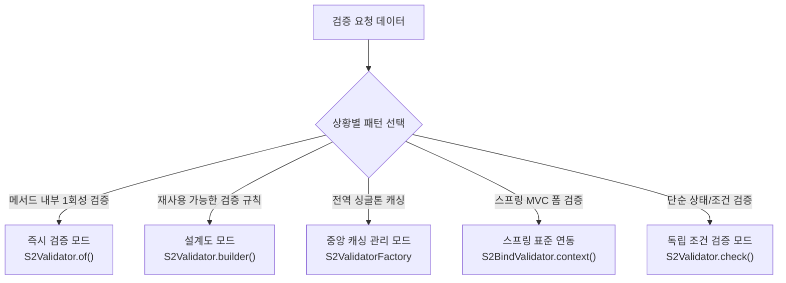
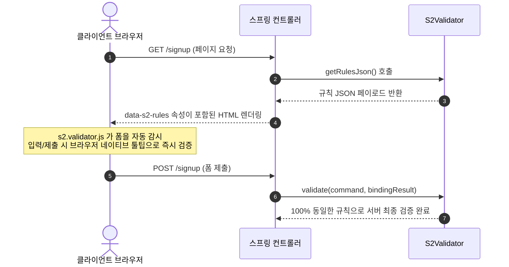

# S2Util 사용자 매뉴얼 (User Manual) 🚀

🌐 [English](MANUAL.md) | **한국어**

> **한 번 정의하고, 어디서나 검증한다 (Write Once, Validate Anywhere).**
> S2Util은 서버(Java)와 클라이언트(JavaScript) 간의 검증 로직을 완벽하게 동기화하고, 리플렉션 병목 없는 초고속 객체 매핑, 지능형 듀얼 캐시, 고성능 스레드 관리, 안전한 동적 JPQL 생성을 지원하는 통합 유틸리티 생태계입니다.

---

## 📑 목차 (Table of Contents)

1. [설치 및 인프라 설정](#1-설치-및-인프라-설정)
   - [1-1. 의존성 및 모듈 구성](#1-1-의존성-및-모듈-구성)
   - [1-2. S2Validator 정적 분석 플러그인 & Dead Code 감지](#1-2-s2validator-정적-분석-플러그인--dead-code-감지)
   - [1-3. 전역 메시지 번들 설정 (선택 사항)](#1-3-전역-메시지-번들-설정-선택-사항)
2. [S2Validator 5대 전략적 검증 패턴](#2-s2validator-5대-전략적-검증-패턴)
   - [A. 즉시 검증 패턴 (Immediate Mode)](#a-즉시-검증-패턴-immediate-mode)
   - [B. 설계도 재사용 패턴 (Blueprint Mode)](#b-설계도-재사용-패턴-blueprint-mode)
   - [C. 중앙 캐싱 관리 패턴 (Registry Mode)](#c-중앙-캐싱-관리-패턴-registry-mode)
   - [D. 스프링 표준 통합 패턴 (Spring Standard Alignment)](#d-스프링-표준-통합-패턴-spring-standard-alignment)
   - [E. 독립 조건 검증 패턴 (Field-less Condition Check Mode)](#e-독립-조건-검증-패턴-field-less-condition-check-mode)
3. [풍부한 검증 규칙 및 조건부 검증](#3-풍부한-검증-규칙-및-조건부-검증)
   - [3-1. 30가지 이상의 내장 규칙 (S2RuleType)](#3-1-30가지-이상의-내장-규칙-s2ruletype)
   - [3-2. 조건부 검증 (when & and)](#3-2-조건부-검증-when--and)
   - [3-3. 필드 간 상호 비교 (Cross-Field Comparisons)](#3-3-필드-간-상호-비교-cross-field-comparisons)
4. [메시지 및 다국어(i18n) 처리](#4-메시지-및-다국어i18n-처리)
   - [4-1. 인라인 다국어 설정 (.ko, .en, .message)](#4-1-인라인-다국어-설정-ko-en-message)
   - [4-2. 한국어 조사 자동 완성 (은/는, 이/가 등)](#4-2-한국어-조사-자동-완성-은는-이가-등)
5. [고급 검증 기법](#5-고급-검증-기법)
   - [5-1. 객체 그래프 탐색 (점, 인덱스, 와일드카드)](#5-1-객체-그래프-탐색-점-인덱스-와일드카드)
   - [5-2. 재귀 및 합성 검증 (EACH, NESTED)](#5-2-재귀-및-합성-검증-each-nested)
   - [5-3. 사용자 정의 비즈니스 람다 (Predicate, BiPredicate)](#5-3-사용자-정의-비즈니스-람다-predicate-bipredicate)
6. [서버-클라이언트 통합 동기화 (Server-Client Sync)](#6-서버-클라이언트-통합-동기화-server-client-sync)
   - [6-1. 전 과정 구현 예제 (End-to-End)](#6-1-전-과정-구현-예제-end-to-end)
   - [6-2. 기술 아키텍처 (s2.validator.js)](#6-2-기술-아키텍처-s2validatorjs)
7. [S2Jpql: 안전한 동적 쿼리 빌더](#7-s2jpql-안전한-동적-쿼리-빌더)
   - [7-1. 템플릿 기반 동적 JPQL 작성](#7-1-템플릿-기반-동적-jpql-작성)
   - [7-2. 페이징 처리 (Pagination)](#7-2-페이징-처리-pagination)
   - [7-3. 보안 아키텍처: SQL Injection 원천 차단](#7-3-보안-아키텍처-sql-injection-원천-차단)
8. [S2Copier: 리플렉션 프리 고성능 객체 복사](#8-s2copier-리플렉션-프리-고성능-객체-복사)
   - [8-1. MethodHandle 기반 객체 매핑](#8-1-methodhandle-기반-객체-매핑)
   - [8-2. 부분 업데이트 & JPA Dirty Checking 연동](#8-2-부분-업데이트--jpa-dirty-checking-연동)
9. [S2Core 툴킷: 필수 핵심 유틸리티](#9-s2core-툴킷-필수-핵심-유틸리티)
   - [9-1. 동적 프로퍼티 접근 (S2Util)](#9-1-동적-프로퍼티-접근-s2util)
   - [9-2. 지능형 듀얼 모드 캐시 (S2Cache)](#9-2-지능형-듀얼-모드-캐시-s2cache)
   - [9-3. 버전 적응형 스레드 풀 (S2ThreadUtil)](#9-3-버전-적응형-스레드-풀-s2threadutil)
   - [9-4. 최적화된 문자열 유틸리티 (S2StringUtil)](#9-4-최적화된-문자열-유틸리티-s2stringutil)

---

## 1. 설치 및 인프라 설정

### 1-1. 의존성 및 모듈 구성

#### 🎯 **선택지 A: 통합 패키지 (All-in-One, 권장)**

단 하나의 의존성만 추가하면 모든 핵심 모듈(`s2-core`, `s2-validator`, `s2-jpa`)이 미리 통합된 상태로 제공됩니다:

**[Gradle]**

```groovy
dependencies {
    implementation 'io.github.devers2:s2-util:1.1.8'
}
```

**[Maven]**

```xml
<dependency>
    <groupId>io.github.devers2</groupId>
    <artifactId>s2-util</artifactId>
    <version>1.1.8</version>
</dependency>
```

---

#### 🧩 **선택지 B: 모듈별 선택적 경량 사용**

프로젝트 아티팩트 크기를 최소화하고 필요한 기능만 선별적으로 도입하려면 서브모듈 단위로 의존성을 선언하세요:

| 모듈                       | 의존성 좌표                      | 전이 의존성 포함 여부      | 주요 기능                                 |
| :------------------------- | :------------------------------- | :------------------------- | :---------------------------------------- |
| **S2Validator**            | `io.github.devers2:s2-validator` | `s2-core` 자동 포함        | 서버-클라이언트 동기화 검증 엔진          |
| **S2BindValidator**        | `io.github.devers2:s2-validator` | `s2-core` 자동 포함        | 스프링 표준 `BindingResult` 연동          |
| **S2Jpql**                 | `io.github.devers2:s2-jpa`       | `s2-core` 자동 포함        | 템플릿 기반 안전한 동적 JPQL 빌더         |
| **S2Copier**               | `io.github.devers2:s2-core`      | 외부 라이브러리 의존성 0개 | 리플렉션 프리 초고속 객체 매핑            |
| **S2Cache / S2ThreadUtil** | `io.github.devers2:s2-core`      | 외부 라이브러리 의존성 0개 | 지능형 캐시 및 가상 스레드(Java 21+) 관리 |

```groovy
dependencies {
    // 1. 검증 기능만 필요한 경우
    implementation 'io.github.devers2:s2-validator:1.1.8'

    // 2. 동적 JPQL 기능만 필요한 경우
    implementation 'io.github.devers2:s2-jpa:1.1.8'

    // 3. 코어 유틸리티 및 객체 복사 기능만 필요한 경우 (가장 경량)
    implementation 'io.github.devers2:s2-core:1.1.8'
}
```

---

### 1-2. S2Validator 정적 분석 플러그인 & Dead Code 감지 ✨

**빌드 타임에 오타와 미완료 코드를 완벽 차단합니다.** 동반 Gradle 플러그인이 `compileJava` 직전에 AST(구문 트리)를 분석하여 다음과 같은 잠재적 오류를 사전에 검출합니다:

1. **컴파일 타임 필드 검증**: `.field("fieldName")`에 작성된 필드명이 대상 DTO 클래스에 실제 존재하는지 확인합니다.
2. **체이닝 완결성 검사 (Dead Code 감지)**:
   - `S2Validator.of()` 체인은 반드시 `.validate()`로 끝나야 합니다.
   - `S2Validator.builder()` 체인은 반드시 `.build()`로 끝나야 합니다.
   - `S2Validator.check()` 체인은 반드시 `.validate()`로 끝나야 합니다.
   - 종단 메서드가 누락된 체인은 검증이 전혀 실행되지 않는 **죽은 코드(Dead Code)**이므로, 플러그인이 즉시 빌드를 실패시켜 운영 배포를 차단합니다.

**[settings.gradle]**

```groovy
pluginManagement {
    repositories {
        mavenCentral()
    }
}
```

**[build.gradle]**

```groovy
plugins {
    id 'io.github.devers2.validator' version '1.1.2'
}
```

> [!IMPORTANT]
> 필드명 정적 분석은 제네릭 타입 정보가 명시된 경우(예: `S2Validator.<UserDTO>builder()`)에 동작합니다.

---

### 1-3. 전역 메시지 번들 설정 (선택 사항)

프로퍼티 파일의 메시지 키를 전역적으로 활용하려면 아래와 같이 번들명을 등록합니다:

```java
// messages.properties 파일의 키를 기본 에러 메시지로 사용하도록 설정
S2BindValidator.setValidationBundle("messages");

// 사용 예시:
// messages.properties -> err.required={0|은/는} 필수 입력 항목입니다.
.field("id", "아이디").rule(S2RuleType.REQUIRED, null, "err.required")
```

---

## 2. S2Validator 5대 전략적 검증 패턴

S2Validator는 비즈니스 상황에 맞춰 선택할 수 있는 5가지 실행 패턴을 제공합니다:



### A. 즉시 검증 패턴 (Immediate Mode)

**사용법:** `S2Validator.of(target, [failFast])`

서비스 메서드 내부에서 들어온 파라미터를 1회성으로 빠르게 검증할 때 사용합니다.

```java
// 1. 예외 발생 모드 (기본값: 검증 실패 시 S2RuntimeException 즉시 발생)
S2Validator.of(userInput)
    .field("email").rule(S2RuleType.REQUIRED).rule(S2RuleType.EMAIL)
    .validate();

// 2. 논리값 반환 모드 (예외 대신 boolean 성공 여부 반환)
boolean isValid = S2Validator.of(userInput, false)
    .field("age").rule(S2RuleType.MIN_VALUE, 20)
    .validate();
```

### B. 설계도 재사용 패턴 (Blueprint Mode)

**사용법:** `S2Validator.builder()`

스레드 안전(Thread-Safe)하며 불변인 검증 설계도를 정의하여 여러 객체에 반복 적용합니다.

```java
// 재사용 가능한 검증 설계도 선언
S2Validator<UserDTO> schema = S2Validator.<UserDTO>builder()
    .field("id", "아이디").rule(S2RuleType.REQUIRED)
    .field("email", "이메일").rule(S2RuleType.EMAIL)
    .build();

// 복수의 인스턴스에 반복 실행
schema.validate(userA);
schema.validate(userB);
```

### C. 중앙 캐싱 관리 패턴 (Registry Mode)

**사용법:** `S2ValidatorFactory.getOrRegister()`

전역 싱글톤 캐싱을 지원하여, 검증기 생성 로직이 최초 1회만 실행되므로 성능이 극대화됩니다.

```java
S2Validator<UserDTO> validator = S2ValidatorFactory.getOrRegister("JOIN_RULES", () ->
    S2Validator.<UserDTO>builder()
        .field("name", "이름").rule(S2RuleType.REQUIRED)
        .build()
);
```

### D. 스프링 표준 통합 패턴 (Spring Standard Alignment)

**사용법:** `S2BindValidator.context()`

스프링 MVC 컨트롤러에서 검증 결과를 스프링 표준 `BindingResult`에 자동으로 주입합니다.

```java
@PostMapping("/join")
public String join(@ModelAttribute UserDTO user, BindingResult result) {
    S2BindValidator.context("JOIN_CTX", this::joinRules).validate(user, result);

    if (result.hasErrors()) {
        return "joinForm"; // 스프링 표준 폼 오류 처리 흐름
    }
    return "redirect:/success";
}
```

### E. 독립 조건 검증 패턴 (Field-less Condition Check Mode)

**사용법:** `S2Validator.check(condition, [errorCode])`

특정 DTO나 필드에 종속되지 않고, 순수한 비즈니스 상태나 조건식 자체를 검증할 때 사용합니다.

```java
// 순수 조건식 직접 검증
S2Validator.check(order.isPayable())
    .ko("결제 가능한 주문 상태가 아닙니다.")
    .en("The order is not in a payable status.")
    .validate();
```

---

## 3. 풍부한 검증 규칙 및 조건부 검증

### 3-1. 30가지 이상의 내장 규칙 (S2RuleType)

| 범주                   | 지원 규칙 목록                                                                                                               |
| :--------------------- | :--------------------------------------------------------------------------------------------------------------------------- |
| **기본 제약 조건**     | `REQUIRED`, `ASSERT_TRUE`, `ASSERT_FALSE`, `EQUALS_FIELD`                                                                    |
| **문자열 길이/바이트** | `LENGTH`, `MIN_LENGTH`, `MAX_LENGTH`, `MIN_BYTE`, `MAX_BYTE`                                                                 |
| **수치 범위 검사**     | `NUMBER`, `MIN_VALUE`, `MAX_VALUE`                                                                                           |
| **형식 및 포맷**       | `EMAIL`, `URL`, `INTERNATIONAL_TEL_NO`, `REGEX`                                                                              |
| **한국 특화 포맷** 🇰🇷  | `TEL_NO`(전화번호), `MPHONE_NO`(휴대폰), `ZIP`(우편번호), `BIZRNO`(사업자번호), `JUMIN`(주민번호), `NWINO`, `PASSWORD_ANSWR` |
| **날짜 및 기간**       | `DATE`, `DATE_AFTER`, `DATE_BEFORE`                                                                                          |
| **텍스트 및 컬렉션**   | `TEXT_INTACT`, `TEXT_COMBINE`, `EACH`, `NESTED`                                                                              |

### 3-2. 조건부 검증 (`when` & `and`)

다른 필드의 값이나 조건에 따라 동적으로 검증 규칙을 적용합니다:

```java
S2Validator.<PaymentDTO>builder()
    .field("paymentMethod").rule(S2RuleType.REQUIRED)
    // 결제수단이 'CARD'일 때만 카드번호가 필수
    .field("cardNumber")
        .when("paymentMethod", "CARD")
        .rule(S2RuleType.REQUIRED)
        .rule(S2RuleType.LENGTH, 16)
    // and()를 결합한 복합 조건 검증
    .field("taxId")
        .when("paymentMethod", "INVOICE")
        .and("isBusiness", true)
        .rule(S2RuleType.REQUIRED)
    .build();
```

### 3-3. 필드 간 상호 비교 (Cross-Field Comparisons)

동일 객체 내 서로 다른 두 필드의 값을 직관적으로 비교합니다:

```java
S2Validator.<RegisterDTO>builder()
    // 비밀번호 확인 일치 검증
    .field("confirmPassword", "비밀번호 확인")
        .rule(S2RuleType.EQUALS_FIELD, "password")
        .ko("비밀번호가 일치하지 않습니다.")
    // 시작일 - 종료일 전후 관계 검증
    .field("endDate", "종료일")
        .rule(S2RuleType.DATE_AFTER, "startDate")
        .ko("종료일은 시작일 이후여야 합니다.")
    .build();
```

---

## 4. 메시지 및 다국어(i18n) 처리

### 4-1. 인라인 다국어 설정 (`.ko`, `.en`, `.message`)

체이닝 과정에서 언어별 메시지를 손쉽게 지정할 수 있습니다:

```java
.field("age", "나이")
    .rule(S2RuleType.MIN_VALUE, 19)
    .ko("만 19세 이상만 가입할 수 있습니다.")
    .en("Age must be at least 19.")
    .message(Locale.JAPAN, "19歳以上である必要があります。")
```

### 4-2. 한국어 조사 자동 완성 (은/는, 이/가 등)

S2Util은 필드명의 종성(받침) 유무를 실시간 분석하여 자연스러운 한국어 조사를 자동 완성합니다:

```java
// 받침 없음 -> "는" 자동 선택: "아이디는 필수 항목입니다."
.field("id", "아이디").ko("{0|은/는} 필수 항목입니다.")

// 받침 있음 -> "은" 자동 선택: "이름은 필수 항목입니다."
.field("name", "이름").ko("{0|은/는} 필수 항목입니다.")
```

---

## 5. 고급 검증 기법

### 5-1. 객체 그래프 탐색 (점, 인덱스, 와일드카드)

복잡하게 중첩된 객체나 컬렉션 구조를 간결한 문자열 경로로 탐색합니다:

- **점 표기법 (`.`)**: 중첩 객체 탐색 (예: `user.profile.address.zipCode`)
- **인덱스 표기법 (`[n]`)**: 특정 순번 요소 탐색 (예: `orders[0].id`)
- **와일드카드 (`[]`)**: 컬렉션 내 모든 요소 일괄 검증 (예: `cart.items[].price`)

### 5-2. 재귀 및 합성 검증 (EACH, NESTED)

```java
// 1. 하위 품목 검증 설계도 정의
S2Validator<ItemDTO> itemValidator = S2Validator.<ItemDTO>builder()
    .field("name", "품목명").rule(S2RuleType.REQUIRED)
    .field("price", "단가").rule(S2RuleType.MIN_VALUE, 0)
    .build();

// 2. 상위 주문 검증기에 합성
S2Validator.<OrderDTO>builder()
    .field("orderId", "주문번호").rule(S2RuleType.REQUIRED)
    .field("items", "주문 품목").rule(S2RuleType.EACH, itemValidator) // 리스트 내 모든 품목 반복 검증
    .field("shippingInfo", "배송지 정보").rule(S2RuleType.NESTED, shippingValidator) // 단일 중첩 객체 검증
    .build();
```

### 5-3. 사용자 정의 비즈니스 람다 (Predicate, BiPredicate)

```java
.field("deliveryDate", "배송희망일")
    .rule((val, target) -> {
        LocalDate delivery = (LocalDate) val;
        LocalDate order = S2Util.getValue(target, "orderDate");
        return delivery.isAfter(order);
    })
    .ko("배송희망일은 주문일자 이후여야 합니다.")
```

---

## 6. 서버-클라이언트 통합 동기화 (Server-Client Sync)

**"서버에서 한 번 정의하고, 브라우저와 서버 양쪽에서 완벽히 실행한다."** 서버에서 작성한 검증 설계도를 JSON으로 추출하여 프론트엔드로 전달하면, 프론트엔드 추가 코드 작성 없이 동일한 검증 엔진이 구동됩니다.



### 6-1. 전 과정 구현 예제 (End-to-End)

#### 1. 서버: 공통 검증 설계도 정의

```java
private S2Validator<UserCommand> signupRules() {
    return S2Validator.<UserCommand>builder()
        .field("userId", "아이디").rule(S2RuleType.REQUIRED)
        .field("password", "비밀번호").rule(S2RuleType.REQUIRED).rule(S2RuleType.MIN_LENGTH, 8)
        .field("confirmPassword", "비밀번호 확인")
            .rule(S2RuleType.REQUIRED)
            .rule(S2RuleType.EQUALS_FIELD, "password")
            .ko("비밀번호 확인이 일치하지 않습니다.")
        .build();
}
```

#### 2. 컨트롤러: 화면 렌더링 시 JSON 규칙 전달 (GET)

```java
@GetMapping("/signup")
public String signupPage(Model model) {
    String rules = S2BindValidator.context("signup", this::signupRules).getRulesJson();
    model.addAttribute("rules", rules);
    return "signup";
}
```

#### 3. 뷰: HTML 폼에 규칙 연결 (View)

```html
<form id="signupForm" th:data-s2-rules="${rules}">
  <input name="userId" type="text" />
  <input name="password" type="password" />
  <input name="confirmPassword" type="password" />
  <button type="submit">가입하기</button>
</form>

<script type="module">
  import '/s2-util/js/s2.validator.js';
</script>
```

#### 4. 컨트롤러: 서버 사이드 최종 검증 (POST)

```java
@PostMapping("/signup")
public String signup(@ModelAttribute("command") UserCommand command, BindingResult result) {
    S2BindValidator.context("signup", this::signupRules).validate(command, result);
    if (result.hasErrors()) {
        return "signup";
    }
    return "redirect:/welcome";
}
```

### 6-2. 기술 아키텍처 (`s2.validator.js`)

- **내장 정적 자원**: `s2.validator.js`는 `s2-validator.jar`의 `META-INF/resources/s2-util/js/` 경로에 내장 배포됩니다.
- **프론트엔드 무의존성**: 순수 바닐라 ES6 자바스크립트로 구현되어 React, Vue, jQuery 등 특정 프레임워크에 종속되지 않습니다.
- **자동 바인딩**: `data-s2-rules` 속성이 부여된 모든 폼을 감지하여 자동 연동됩니다.

---

## 7. S2Jpql: 안전한 동적 쿼리 빌더

Java Text Block(`"""`)과 템플릿 문법을 결합하여, 가독성 높은 동적 JPQL을 생성하면서도 SQL Injection을 원천 차단합니다.

### 7-1. 템플릿 기반 동적 JPQL 작성

```java
String jpql = """
    SELECT p
    FROM Product p
    WHERE 1=1
        {{=cond_name}}
        {{=cond_price}}
    {{=sort}}
""";

return S2Jpql.from(em).type(Product.class).query(jpql)
    .bindClause("cond_name", name, "AND p.name LIKE :name")
        .bindParameter("name", name, LikeMode.ANYWHERE)
    .bindClause("cond_price", price, "AND p.price >= :price")
        .bindParameter("price", price)
    .bindOrderBy("sort", sort)
    .build().getResultList();
```

### 7-2. 페이징 처리 (Pagination)

```java
// 1. 직접 페이징 (offset, limit)
S2Jpql.from(em).type(Product.class).query(jpql)
    .limit(0, 20) // 첫 번째 페이지: 0 ~ 19번 행
    .build().getResultList();

// 2. 조건부 페이징: 조건이 true일 때만 페이징 적용
S2Jpql.from(em).type(Product.class).query(jpql)
    .limit(pageable != null, pageNumber * pageSize, pageSize)
    .build().getResultList();
```

### 7-3. 보안 아키텍처: SQL Injection 원천 차단

> [!WARNING]
> **엄격한 아키텍처적 책임 분리:**
>
> - `bindClause()`는 오직 **정적 SQL 절 프래그먼트를 조건부로 포함**할 때만 사용해야 합니다.
> - `bindParameter()`는 오직 **동적 파라미터 값을 안전하게 바인딩**할 때만 사용해야 합니다.
>
> 1. **절(Clause)은 반드시 하드코딩된 문자열이어야 합니다**: 절대 사용자 입력값을 절 문자열에 직접 연결하지 마세요.
> 2. **모든 동적 값은 반드시 `bindParameter()`를 거쳐야 합니다**: `String.format`이나 `+` 연산자로 값을 절에 주입하지 마세요.

```java
// ✅ 안전한 사용: 절은 하드코딩되고, 값은 bindParameter를 통해 안전하게 바인딩됨
.bindClause("cond_name", userInput, "AND p.name LIKE :name")
    .bindParameter("name", userInput, LikeMode.ANYWHERE)

// ❌ 위험한 사용: 사용자 입력을 절 문자열에 결합하면 SQL Injection 발생!
.bindClause("cond", userInput, "AND p.name LIKE '%" + userInput + "%'")
```

---

## 8. S2Copier: 리플렉션 프리 고성능 객체 복사

`MethodHandle` 캐싱 메커니즘을 적용하여, 기존의 느린 Java Reflection 병목 없이 DTO와 엔티티 간 초고속 데이터 매핑을 제공합니다.

### 8-1. MethodHandle 기반 객체 매핑

```java
// 리플렉션 오버헤드 없는 고속 프로퍼티 복사
UserDTO dto = S2Copier.from(userEntity).to(UserDTO.class);
```

### 8-2. 부분 업데이트 & JPA Dirty Checking 연동

```java
// PATCH 요청에 최적화된 부분 업데이트
S2Copier.from(requestDto)
    .exclude("id", "createdAt")      // 보안/불변 필드 제외
    .map("nickName", "displayName")  // 이름이 다른 프로퍼티 매핑
    .ignoreNulls()                   // null 값 무시: JPA Dirty Checking을 깔끔하게 유도
    .to(existingEntity);
```

---

## 9. S2Core 툴킷: 필수 핵심 유틸리티

### 9-1. 동적 프로퍼티 접근 (`S2Util`)

Map, Record, Array, List, 일반 DTO 간의 계층형 프로퍼티를 자유자재로 읽고 씁니다:

```java
// 점/인덱스 표기법으로 깊은 속성 읽기
String city = S2Util.getValue(user, "address.city");
String role = S2Util.getValue(user, "roles[0].name");

// 동적으로 속성 값 변경
S2Util.setValue(user, "address.city", "대전");
```

### 9-2. 지능형 듀얼 모드 캐시 (`S2Cache`)

- **기본 모드 (무의존성)**: `S2OptimisticCache`가 락 프리(Lock-free) 읽기와 원자적 쓰기를 제공합니다.
- **엔터프라이즈 모드 (Caffeine)**: 클래스패스에 Caffeine 라이브러리가 감지되면 최고 성능의 **Caffeine W-TinyLFU**로 자동 전환됩니다.
- **상태 확인**: `S2Cache.isCaffeineEnabled()`로 현재 활성화된 캐시 엔진을 확인할 수 있습니다.

### 9-3. 버전 적응형 스레드 풀 (`S2ThreadUtil`)

- **Java 21+ 환경**: OS 스레드 낭비가 없는 **가상 스레드(Virtual Threads)**를 자동 감지하여 할당합니다.
- **Java 17 환경**: 최적화된 플랫폼 스레드 풀로 자동 폴백(Fallback)됩니다.
- **공용 실행기**: `S2ThreadUtil.getCommonExecutor()` 또는 `S2ThreadUtil.newExecutor(maxThreads)`.

### 9-4. 최적화된 문자열 유틸리티 (`S2StringUtil`)

- **정규식 패턴 캐싱**: `S2StringUtil.replaceAll()`은 컴파일된 정규식 패턴을 캐싱하여 반복적인 `Pattern.compile()` 오버헤드를 제거합니다.
- **입력 정제**: `S2StringUtil.sanitizeInput()`으로 제어문자 및 유해 입력을 정제합니다.
- **조사 연산**: `S2StringUtil.appendJosa()`로 프로그램 코드에서 한국어 조사를 문맥에 맞게 덧붙입니다.

---

[//]: # 'S2_DEPS_INFO_START'

---

**특정 기능(예: S2BindValidator)을 사용하려면 런타임에 다음 의존성을 엔드유저 프로젝트에 명시적으로 추가해야 합니다.** 이 의존성이 누락되면 런타임에 `java.lang.NoClassDefFoundError`가 발생합니다.

**[Gradle 사용자]**

```groovy
dependencies {
    // 선택적 기능을 위한 필수 런타임 의존성
    implementation 'com.github.ben-manes.caffeine:caffeine:3.2.4'
    implementation 'org.springframework:spring-context:6.2.19'
    implementation 'jakarta.persistence:jakarta.persistence-api:3.2.0'
}
```

[//]: # 'S2_DEPS_INFO_END'

s2-util Version: 1.1.8 (2026-09-11)
