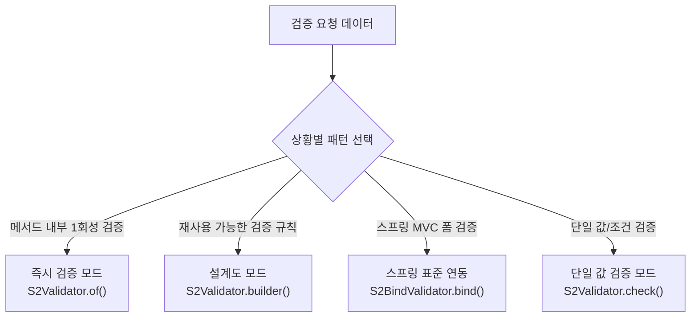
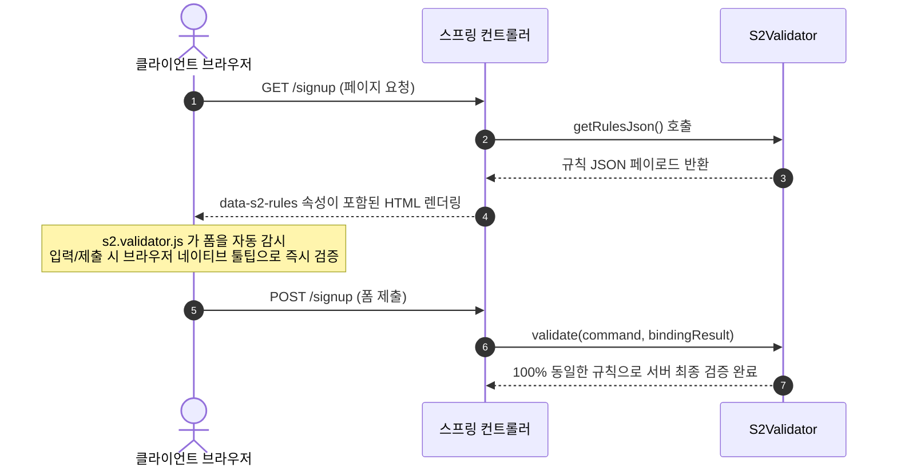

# S2Util 사용자 매뉴얼 (User Manual) 🚀

🌐 [English](MANUAL.md) | **한국어**

> **한 번 정의하고, 어디서나 검증한다 (Write Once, Validate Anywhere).**
> S2Util은 서버(Java)와 클라이언트(JavaScript) 간의 검증 로직을 완벽하게 동기화하고, 리플렉션 병목 없는 초고속 객체 매핑, 지능형 듀얼 캐시, 고성능 스레드 관리, 안전한 동적 JPQL 생성을 지원하는 통합 유틸리티 생태계입니다.

---

## 📑 목차 (Table of Contents)

1. [설치 및 인프라 설정](#1-설치-및-인프라-설정)
   - [1-1. 의존성 및 모듈 구성](#1-1-의존성-및-모듈-구성)
   - [1-2. S2Validator 정적 분석 플러그인 & Dead Code 감지](#1-2-s2validator-정적-분석-플러그인--dead-code-감지-)
   - [1-3. 전역 메시지 번들 설정 (선택 사항)](#1-3-전역-메시지-번들-설정-선택-사항)
2. [S2Validator 4대 전략적 검증 패턴](#2-s2validator-4대-전략적-검증-패턴)
   - [A. 즉시 검증 패턴 (Immediate Mode)](#a-즉시-검증-패턴-immediate-mode)
   - [B. 설계도 재사용 패턴 (Blueprint Mode)](#b-설계도-재사용-패턴-blueprint-mode)
   - [C. 스프링 표준 통합 패턴 (권장)](#c-스프링-표준-통합-패턴-권장)
   - [D. 단일 값 및 독립 조건 검증 패턴 (Single Value & Condition Check Mode)](#d-단일-값-및-독립-조건-검증-패턴-single-value--condition-check-mode)
3. [풍부한 검증 규칙 및 조건부 검증](#3-풍부한-검증-규칙-및-조건부-검증)
   - [3-1. 30가지 이상의 내장 규칙 (S2RuleType)](#3-1-30가지-이상의-내장-규칙-s2ruletype)
   - [3-2. 조건부 검증 (when & and)](#3-2-조건부-검증-when--and)
   - [3-3. 필드 간 상호 비교 (Cross-Field Comparisons)](#3-3-필드-간-상호-비교-cross-field-comparisons)
4. [메시지 및 다국어(i18n) 처리](#4-메시지-및-다국어i18n-처리)
   - [4-1. 인라인 다국어 설정 (.ko, .en, .message)](#4-1-인라인-다국어-설정-ko-en-message)
   - [4-2. 한국어 조사 자동 완성 (은/는, 이/가 등)](#4-2-한국어-조사-자동-완성-은는-이가-등)
5. [고급 검증 기법](#5-고급-검증-기법)
   - [5-1. 객체 그래프 탐색 (점, 인덱스, 와일드카드)](#5-1-객체-그래프-탐색-점-인덱스-와일드카드)
   - [5-2. 재귀 및 합성 검증 (EACH, NESTED)](#5-2-재귀-및-합성-검증-each-nested)
   - [5-3. 사용자 정의 비즈니스 람다: Predicate & BiPredicate (서버 전용)](#5-3-사용자-정의-비즈니스-람다-predicate--bipredicate-서버-전용)
   - [5-4. 규칙 JSON 으로 검증기 만들기 (fromJson)](#5-4-규칙-json-으로-검증기-만들기-fromjson)
6. [서버-클라이언트 통합 동기화 (Server-Client Sync)](#6-서버-클라이언트-통합-동기화-server-client-sync)
   - [6-1. 전 과정 구현 예제 (End-to-End)](#6-1-전-과정-구현-예제-end-to-end)
   - [6-2. 기술 아키텍처 (s2.validator.js)](#6-2-기술-아키텍처-s2validatorjs)
7. [S2Jpql: 안전한 동적 쿼리 빌더](#7-s2jpql-안전한-동적-쿼리-빌더)
   - [7-1. 템플릿 기반 동적 JPQL 작성](#7-1-템플릿-기반-동적-jpql-작성)
   - [7-2. 페이징 처리 (Pagination)](#7-2-페이징-처리-pagination)
   - [7-3. 보안 아키텍처: SQL Injection 원천 차단](#7-3-보안-아키텍처-sql-injection-원천-차단)
8. [S2Copier: 리플렉션 프리 고성능 객체 복사](#8-s2copier-리플렉션-프리-고성능-객체-복사)
   - [8-1. MethodHandle 기반 객체 매핑](#8-1-methodhandle-기반-객체-매핑)
   - [8-2. 부분 업데이트 & JPA Dirty Checking 연동](#8-2-부분-업데이트--jpa-dirty-checking-연동)
9. [S2Core 툴킷: 필수 핵심 유틸리티](#9-s2core-툴킷-필수-핵심-유틸리티)
   - [9-1. 동적 프로퍼티 접근 (S2Util)](#9-1-동적-프로퍼티-접근-s2util)
   - [9-2. 지능형 듀얼 모드 캐시 (S2Cache)](#9-2-지능형-듀얼-모드-캐시-s2cache)
   - [9-3. 버전 적응형 스레드 풀 (S2ThreadUtil)](#9-3-버전-적응형-스레드-풀-s2threadutil)
   - [9-4. 최적화된 문자열 유틸리티 (S2StringUtil)](#9-4-최적화된-문자열-유틸리티-s2stringutil)
   - [9-5. 경량 JSON (S2JsonUtil)](#9-5-경량-json-s2jsonutil)

---

## 1. 설치 및 인프라 설정

### 1-1. 의존성 및 모듈 구성

#### 🎯 **선택지 A: 통합 패키지 (All-in-One, 권장)**

단 하나의 의존성만 추가하면 모든 핵심 모듈(`s2-core`, `s2-validator`, `s2-jpa`)이 미리 통합된 상태로 제공됩니다:

**[Gradle]**

```groovy
dependencies {
    implementation 'io.github.devers2:s2-util:2.0.0'
}
```

**[Maven]**

```xml
<dependency>
    <groupId>io.github.devers2</groupId>
    <artifactId>s2-util</artifactId>
    <version>2.0.0</version>
</dependency>
```

---

#### 🧩 **선택지 B: 모듈별 선택적 경량 사용**

프로젝트 아티팩트 크기를 최소화하고 필요한 기능만 선별적으로 도입하려면 서브모듈 단위로 의존성을 선언하세요:

| 모듈                       | 의존성 좌표                      | 전이 의존성 포함 여부      | 주요 기능                                 |
| :------------------------- | :------------------------------- | :------------------------- | :---------------------------------------- |
| **S2Validator**            | `io.github.devers2:s2-validator` | `s2-core` 자동 포함        | 서버-클라이언트 동기화 검증 엔진          |
| **S2BindValidator**        | `io.github.devers2:s2-validator` | `s2-core` 자동 포함        | 스프링 표준 `BindingResult` 연동          |
| **S2Jpql**                 | `io.github.devers2:s2-jpa`       | `s2-core` 자동 포함        | 템플릿 기반 안전한 동적 JPQL 빌더         |
| **S2Copier**               | `io.github.devers2:s2-core`      | 외부 라이브러리 의존성 0개 | 리플렉션 프리 초고속 객체 매핑            |
| **S2Cache / S2ThreadUtil** | `io.github.devers2:s2-core`      | 외부 라이브러리 의존성 0개 | 지능형 캐시 및 가상 스레드(Java 21+) 관리 |

```groovy
dependencies {
    // 1. 검증 기능만 필요한 경우
    implementation 'io.github.devers2:s2-validator:2.0.0'

    // 2. 동적 JPQL 기능만 필요한 경우
    implementation 'io.github.devers2:s2-jpa:2.0.0'

    // 3. 코어 유틸리티 및 객체 복사 기능만 필요한 경우 (가장 경량)
    implementation 'io.github.devers2:s2-core:2.0.0'
}
```

---

### 1-2. S2Validator 정적 분석 플러그인 & Dead Code 감지 ✨

**빌드 타임에 오타와 미완료 코드를 완벽 차단합니다.** 동반 Gradle 플러그인이 `compileJava` 직전에 AST(구문 트리)를 분석하여 다음과 같은 잠재적 오류를 사전에 검출합니다:

1. **컴파일 타임 필드 검증**: `.field("fieldName")`에 작성된 필드명이 대상 DTO 클래스에 실제 존재하는지 확인합니다.
2. **체이닝 완결성 검사 (Dead Code 감지)**:
   - `S2Validator.of()` 체인은 반드시 `.validate()`로 끝나야 합니다.
   - `S2Validator.builder()` 체인은 반드시 `.build()`로 끝나야 합니다.
   - `S2Validator.check()` 체인은 반드시 `.validate()`로 끝나야 합니다.
   - 종단 메서드가 누락된 체인은 검증이 전혀 실행되지 않는 **죽은 코드(Dead Code)**이므로, 플러그인이 즉시 빌드를 실패시켜 운영 배포를 차단합니다.

**[settings.gradle]**

```groovy
pluginManagement {
    repositories {
        mavenCentral()
    }
}
```

**[build.gradle]**

```groovy
plugins {
    id 'io.github.devers2.validator' version '2.0.0'
}
```

> [!IMPORTANT]
> 필드명 정적 분석 대상 DTO 는 `S2Validator.<UserDTO>builder()`처럼 명시한 타입 인자, 또는 `S2Validator.of(dto)` 인자의 선언 타입으로 찾습니다.
> 바뀐 소스가 없으면 태스크는 `UP-TO-DATE`로 건너뛰며 빌드 캐시도 지원합니다.

---

### 1-3. 전역 메시지 번들 설정 (선택 사항)

프로퍼티 파일의 메시지 키를 전역적으로 활용하려면 아래와 같이 번들명을 등록합니다:

```java
// messages.properties 파일의 키를 기본 에러 메시지로 사용하도록 설정
S2BindValidator.setValidationBundle("messages");

// 사용 예시:
// messages.properties -> err.required={0|은/는} 필수 입력 항목입니다.
.field("id", "아이디").rule(S2RuleType.REQUIRED, null, "err.required")
```

---

## 2. S2Validator 4대 전략적 검증 패턴

S2Validator는 비즈니스 상황에 맞춰 선택할 수 있는 4가지 실행 패턴을 제공합니다:


```mermaid
flowchart TD
    Req["검증 요청 데이터"] --> Choice{"상황별 패턴 선택"}
    Choice -->|"메서드 내부 1회성 검증"| A["즉시 검증 모드<br>S2Validator.of()"]
    Choice -->|"재사용 가능한 검증 규칙"| B["설계도 모드<br>S2Validator.builder()"]
    Choice -->|"스프링 MVC 폼 검증"| C["스프링 표준 연동<br>S2BindValidator.bind()"]
    Choice -->|"단일 값/조건 검증"| D["단일 값 검증 모드<br>S2Validator.check()"]
```

### A. 즉시 검증 패턴 (Immediate Mode)

**사용법:** `S2Validator.of(target, [failFast])`

서비스 메서드 내부에서 들어온 파라미터를 1회성으로 빠르게 검증할 때 사용합니다.

```java
// 1. 예외 발생 모드 (기본값: 검증 실패 시 S2ValidationException 즉시 발생)
S2Validator.of(userInput)
    .field("email").rule(S2RuleType.REQUIRED).rule(S2RuleType.EMAIL)
    .validate();

// 2. 논리값 반환 모드 (예외 대신 boolean 성공 여부 반환)
boolean isValid = S2Validator.of(userInput, false)
    .field("age").rule(S2RuleType.MIN_VALUE, 20)
    .validate();

// 3. 간단한 필수 검증: 규칙을 생략하면 REQUIRED 가 적용됩니다
S2Validator.of(userInput)
    .field("name", "이름")
    .field("phone", "연락처")
    .validate();
```

#### 필수 검증 정책 (의도된 설계)

| 선언 | 빈 값일 때 | 설명 |
|---|---|---|
| `.field("name", "이름")` | **거부** | 규칙이 없으면 `REQUIRED`가 자동 적용됩니다. 간단한 필수 검증용 축약형입니다. |
| `.field("email", "이메일").rule(EMAIL)` | **통과** | 규칙을 하나라도 추가하면 추가한 규칙만 적용됩니다. 형식 규칙은 빈 값을 건너뜁니다. |
| `.field("email", "이메일").rule(REQUIRED).rule(EMAIL)` | **거부** | 값도 반드시 있어야 하면 `REQUIRED`를 명시합니다. |

- 서버와 브라우저(규칙 JSON)가 같게 동작합니다.
- 빈 값을 건너뛰지 않는 예외: `ASSERT_TRUE`/`ASSERT_FALSE`, `.includeEmpty()`를 붙인 커스텀 람다.
- 커스텀 람다만 있는 필드도 "규칙이 있는 필드"라서 `REQUIRED`가 자동 적용되지 않습니다.
- 자동 필수 검증의 메시지는 내장 문구(`{0|은/는} 필수 입력 항목입니다.`)입니다. 필드별로 바꾸려면 규칙을 명시하고
  (`.rule(S2RuleType.REQUIRED).ko("…")`), 전역으로 바꾸려면 [전역 메시지 번들](#1-3-전역-메시지-번들-설정-선택-사항)에
  `valid.err.required` 키를 정의합니다.

### B. 설계도 재사용 패턴 (Blueprint Mode)

**사용법:** `S2Validator.builder()`

스레드 안전(Thread-Safe)하며 불변인 검증 설계도를 정의하여 여러 객체에 반복 적용합니다.

```java
// 재사용 가능한 검증 설계도 선언
S2Validator<UserDTO> schema = S2Validator.<UserDTO>builder()
    .field("id", "아이디").rule(S2RuleType.REQUIRED)
    .field("email", "이메일").rule(S2RuleType.EMAIL)
    .build();

// 복수의 인스턴스에 반복 실행
schema.validate(userA);
schema.validate(userB);
```

### C. 스프링 표준 통합 패턴 (권장)

**사용법:** `S2BindValidator.bind(validator)` — `S2Validator.builder()`로 만든 검증기를 Spring 에 연결합니다 (객체 하나를 즉시 검증하는 `S2Validator.of(target)`과 다름)

스프링 MVC 컨트롤러에서 검증 결과를 스프링 표준 `BindingResult`에 자동으로 주입합니다. 검증기 인스턴스를 직접 전달하므로 충돌하거나 시험 사이에 초기화해야 할 전역 상태가 없습니다. 검증기 생성 비용은 일반적인 폼에서 1마이크로초 미만이라 요청마다 만들어도 되며, 규칙 정의 자체가 무거우면 상수나 Spring 빈으로 보관하십시오. GET 폼(`getRulesJson()`)과 POST 처리(`validate()`)에 같은 인스턴스(또는 같은 규칙 정의 메서드)를 쓰면 양쪽이 동일한 규칙을 적용합니다.

```java
// Controller 내 static final 또는 Spring Bean으로 선언 (권장)
private static final S2Validator<UserDTO> USER_VALIDATOR = S2Validator.<UserDTO>builder()
    .field("name", "이름").rule(S2RuleType.REQUIRED)
    .build();

@PostMapping("/join")
public String join(@ModelAttribute UserDTO user, BindingResult result) {
    S2BindValidator.bind(USER_VALIDATOR).validate(user, result);

    if (result.hasErrors()) {
        return "joinForm"; // 스프링 표준 폼 오류 처리 흐름
    }
    return "redirect:/success";
}
```

#### 바인딩 방식 고르기

| 방식 | 언제 쓰나 |
|---|---|
| **필드** `private final BoundContext<T> x = S2BindValidator.bind(rules());` | 기본. 컨트롤러 인스턴스마다 한 번 만들어 GET 폼과 POST 처리가 공유합니다. |
| **생성자** `this.x = S2BindValidator.bind(rules());` | 규칙 정의가 주입받은 의존성(예: 코드 목록 서비스)을 쓰는 경우. |
| **호출마다** `S2BindValidator.bind(rules()).validate(...)` | 규칙이 실행 중에 바뀌는 경우(예: DB 에서 선택지를 불러옴). 일반적인 폼에서 생성 비용은 약 0.5µs 입니다. |

> [!WARNING]
> 필드 초기화는 생성자 본문보다 **먼저** 실행됩니다. `rules()`가 생성자에서 넣거나 `@Autowired`로 주입받는 의존성을 읽으면 그 시점에는 아직 `null`이라 필드 초기화에서 `NullPointerException`이 납니다. 대입 뒤 생성자에서 바인딩하거나 호출마다 바인딩하십시오:
>
> ```java
> private final CodeService codeService;
> private final S2BindValidator.BoundContext<SignupCommand> signup;
>
> public SignupController(CodeService codeService) {
>     this.codeService = codeService;
>     this.signup = S2BindValidator.bind(signupRules()); // 여기서는 signupRules()가 codeService 를 써도 됨
> }
> ```

`BoundContext`는 검증기만 들고 있고 요청 로케일은 호출할 때마다 읽으므로, 필드에 두어도 스레드에 안전합니다.

### D. 단일 값 및 독립 조건 검증 패턴 (Single Value & Condition Check Mode)

**사용법:** `S2Validator.check(value, [label])` / `S2Validator.check(condition, [errorCode])`

DTO나 Map 객체를 만들지 않고 개별 변수, 파라미터 값, 또는 임의의 비즈니스 조건식을 직접 검증할 때 사용합니다:

```java
// 1) 단일 값 - Boolean 모드 (예외 없이 true/false 반환)
boolean isValidEmail = S2Validator.check("user@example.com")
    .rule(S2RuleType.REQUIRED)
    .rule(S2RuleType.EMAIL)
    .validate();

// 2) 단일 값 - 라벨 지정 예외 모드 (검증 실패 시 S2ValidationException 발생)
S2Validator.check(userInput, "사용자 이름")
    .rule(S2RuleType.REQUIRED)
    .rule(S2RuleType.MIN_LENGTH, 2)
    .validate();

// 3) 순수 조건식 직접 검증 모드
S2Validator.check(order.isPayable())
    .ko("결제 가능한 주문 상태가 아닙니다.")
    .en("The order is not in a payable status.")
    .validate();
```

---

## 3. 풍부한 검증 규칙 및 조건부 검증

### 3-1. 30가지 이상의 내장 규칙 (S2RuleType)

| 범주                   | 지원 규칙 목록                                                                                                               |
| :--------------------- | :--------------------------------------------------------------------------------------------------------------------------- |
| **기본 제약 조건**     | `REQUIRED`, `ASSERT_TRUE`, `ASSERT_FALSE`, `EQUALS_FIELD`                                                                    |
| **문자열 길이/바이트** | `LENGTH`, `MIN_LENGTH`, `MAX_LENGTH`, `MIN_BYTE`, `MAX_BYTE`                                                                 |
| **수치 범위 검사**     | `NUMBER`, `MIN_VALUE`, `MAX_VALUE`                                                                                           |
| **형식 및 포맷**       | `EMAIL`, `URL`, `INTERNATIONAL_TEL_NO`, `PASSWORD`, `REGEX`                                                                 |
| **한국 특화 포맷** 🇰🇷  | `TEL_NO`(전화번호), `MPHONE_NO`(휴대폰), `ZIP`(우편번호), `BIZRNO`(사업자번호), `JUMIN`(주민번호), `NWINO`, `PASSWORD_ANSWR` |
| **날짜 및 기간**       | `DATE`, `DATE_AFTER`, `DATE_BEFORE`                                                                                          |
| **텍스트 및 컬렉션**   | `TEXT_INTACT`, `TEXT_COMBINE`, `EACH`, `NESTED`                                                                              |

#### 주요 보안 및 특화 규칙 상세 정책

- **`ASSERT_TRUE` / `ASSERT_FALSE` (체크박스·동의)**:
  - 빈 값(체크하지 않아 전송되지 않은 체크박스)도 판정합니다. 따라서 필수 동의 체크박스는 `ASSERT_TRUE` 하나로 충분합니다.
  - `REQUIRED`를 함께 붙이면 체크하지 않았을 때 메시지가 2개(필수 입력 + 선택 필요) 나갑니다.
  - `true`/`on`(체크), `false`/`off`/빈 문자열(미체크) 문자열도 인식하므로 `Map` 바인딩에서도 동작합니다.
- **`PASSWORD` (현대적 표준 보안 준수)**:
  - 영문자(`a-zA-Z`), 숫자(`0-9`), 32종 특수문자(`!@#$%^&*()_+-=[]{};':"\|,.<>/?~```)의 **3종 조합 필수**.
  - 길이: **8자 ~ 64자** (KISA 및 최신 보안 가이드라인 준수).
  - *비밀번호 정책 커스터마이징*: 기업별 특수 정책(예: 영문 대/소문자 분리 필수 등)이 필요한 경우 `S2RuleType.REGEX`를 활용하여 자유롭게 커스텀할 수 있습니다:
    ```java
    // 예: 최소 8자, 대문자/소문자/숫자/특수문자 4종 필수
    .field("password", "비밀번호")
        .rule(S2RuleType.REGEX, "^(?=.*[a-z])(?=.*[A-Z])(?=.*\\d)(?=.*[@$!%*?&])[A-Za-z\\d@$!%*?&]{8,}$")
        .ko("비밀번호는 영문 대/소문자, 숫자, 특수문자를 모두 포함해야 합니다.");
    ```
- **`JUMIN` (주민등록번호)**:
  - **기본 (`.rule(S2RuleType.JUMIN)`)**: 13자리 숫자(하이픈 허용), 캘린더 생년월일(윤년, 2월 30일 등 유효 일자), 성별 코드(1~8, 9, 0)를 검증합니다. 검증번호(마지막 자리)는 검사하지 않습니다.
  - **검증번호 검사 (`.rule(S2RuleType.JUMIN, true)`)**: 2020년 10월 이전 출생자에 한해 기존 Modulo 11 검증번호도 검사합니다.
  - **기본값이 끔인 이유**: 2020년 10월부터 주민등록번호를 신규로 부여받거나 변경하는 경우 출생일과 무관하게 뒷자리가 임의번호로 부여됩니다. 번호만으로는 부여 시점을 알 수 없어, 검증번호 검사는 그 전에 태어나 번호를 새로 받은 사람의 정상 번호를 거부할 수 있습니다.
- **`BIZRNO` (사업자등록번호)**:
  - **기본 (`.rule(S2RuleType.BIZRNO)`)**: `000-00-00000` 또는 숫자 10자리 형식만 검사합니다.
  - **검증번호 검사 (`.rule(S2RuleType.BIZRNO, true)`)**: 10번째 자리 검증번호도 확인해 형식만 맞는 임의 번호(예: `123-45-67890`)를 거부합니다. 시험 데이터에 임의 번호를 쓰는 경우가 많아 켜야만 동작합니다.

### 3-2. 조건부 검증 (`when` & `and`)

다른 필드의 값이나 조건에 따라 동적으로 검증 규칙을 적용합니다:

```java
S2Validator.<PaymentDTO>builder()
    .field("paymentMethod").rule(S2RuleType.REQUIRED)
    // 결제수단이 'CARD'일 때만 카드번호가 필수
    .field("cardNumber")
        .when("paymentMethod", "CARD")
        .rule(S2RuleType.REQUIRED)
        .rule(S2RuleType.LENGTH, 16)
    // and()를 결합한 복합 조건 검증
    .field("taxId")
        .when("paymentMethod", "INVOICE")
        .and("isBusiness", true)
        .rule(S2RuleType.REQUIRED)
    .build();
```

#### 비교 연산자 (`S2Operator`)

`when(field, value)`는 "같음"입니다. 다른 비교는 연산자를 넘깁니다. 서버와 브라우저가 같은 방식으로 판정합니다.

```java
.field("guardianName").when("age", S2Operator.LT, 14).rule(S2RuleType.REQUIRED)          // 14세 미만이면 보호자 필수
.field("reason").when("status", S2Operator.IN, List.of("REJECT", "HOLD")).rule(S2RuleType.REQUIRED)
.field("memo").when("type", S2Operator.NE, "NORMAL").and("amount", S2Operator.GTE, 1000000).rule(S2RuleType.REQUIRED)
.field("phone").when("email", S2Operator.EMPTY).rule(S2RuleType.REQUIRED)                 // 이메일이 없으면 전화번호 필수
```

| 연산자 | 조건 충족 |
|---|---|
| `EQ` (기본) | 같음. 체크박스 그룹이면 해당 값을 포함. `when(field, null)`은 비었음 |
| `NE` | 같지 않음 (`EQ`의 반대이므로 빈 값도 충족) |
| `GT` `GTE` `LT` `LTE` | 숫자 비교. `MIN_VALUE`와 같이 일반 숫자만 인정하며, 비었거나 `"1,000"`처럼 숫자가 아니면 불충족 |
| `IN` / `NOT_IN` | 목록(컬렉션 또는 배열) 중 하나와 같음 / 어느 것과도 같지 않음. 체크박스 그룹은 하나라도 포함하면 `IN` |
| `EMPTY` / `NOT_EMPTY` | 비었음 / 값 있음. 공백 문자열과 체크하지 않은 그룹도 빈 값 |

- 비교 값이 연산자에 맞지 않으면(`GT`에 `"abc"`, `IN`에 목록이 아닌 값) 검증기를 만들 때 `IllegalArgumentException`이 납니다.
- 조건 필드는 현재 행/객체에서 먼저 찾고, 없으면 바깥 객체를 거쳐 루트에서 찾습니다(`items[].type` 같은 행 조건 포함).

### 3-3. 필드 간 상호 비교 (Cross-Field Comparisons)

동일 객체 내 서로 다른 두 필드의 값을 직관적으로 비교합니다:

```java
S2Validator.<RegisterDTO>builder()
    // 비밀번호 확인 일치 검증
    .field("confirmPassword", "비밀번호 확인")
        .rule(S2RuleType.EQUALS_FIELD, "password")
        .ko("비밀번호가 일치하지 않습니다.")
    // 시작일 - 종료일 전후 관계 검증
    .field("endDate", "종료일")
        .rule(S2RuleType.DATE_AFTER, "startDate")
        .ko("종료일은 시작일 이후여야 합니다.")
    .build();
```

---

## 4. 메시지 및 다국어(i18n) 처리

### 4-1. 인라인 다국어 설정 (`.ko`, `.en`, `.message`)

체이닝 과정에서 규칙 바로 뒤에 메시지를 붙입니다. 각 호출은 바로 앞의 규칙에 적용됩니다.

| 메서드 | 의미 |
|---|---|
| `.message(문구)` | 언어별 문구가 없는 **모든 언어의 기본 메시지**. 한 언어만 쓰는 서비스는 이것 하나로 충분합니다. |
| `.message(문구, 로케일)` | 특정 언어의 메시지 (`Locale.JAPAN`과 `Locale.JAPANESE`는 같음: 언어만 사용). 로케일이 `null`이면 `.message(문구)`와 같습니다. |
| `.ko(문구)` / `.en(문구)` | `.message(문구, Locale.KOREAN)` / `.message(문구, Locale.ENGLISH)`의 단축형. |
| `.rule(타입, 기준값, 메시지키)` | `S2Validator.setValidationBundle(...)`로 설정한 번들에서 키로 메시지를 조회 (1-3 참고). |

```java
// 1) 한 언어만 쓰는 서비스: 기본 메시지 하나
.field("name", "이름")
    .rule(S2RuleType.REQUIRED)
    .message("{0|은/는} 꼭 입력해 주세요.")

// 2) 기본 메시지 + 언어별 덮어쓰기
.field("age", "나이")
    .rule(S2RuleType.MIN_VALUE, 19)
    .message("만 19세 이상이어야 합니다.")               // 별도 문구가 없는 모든 언어
    .en("Age must be at least 19.")                    // 영어 요청
    .message("19歳以上である必要があります。", Locale.JAPAN) // 일본어 요청

// 3) 번들의 메시지 키 사용 (messages.properties: err.adult={0|은/는} {1}세 이상이어야 합니다.)
.field("age", "나이")
    .rule(S2RuleType.MIN_VALUE, 19, "err.adult")
```

**조회 순서** (요청 로케일 기준):

1. 규칙 키에 해당하는 번들 메시지 (`setValidationBundle` + 키)
2. 요청 언어의 메시지 (`.message(문구, 로케일)`, `.ko`, `.en`)
3. 기본 메시지 (`.message(문구)`)
4. 기본 로케일 언어의 메시지 (`S2Validator.setDefaultLocale`)
5. 규칙의 내장 메시지 (한국어/영어)

치환자: `{0}`은 필드 라벨, `{1}`은 규칙 기준값입니다(예: `19`, `EQUALS_FIELD`는 대상 필드의 라벨). 메시지는 서버에서 만들어지므로 브라우저로 보내는 규칙 JSON 에는 요청 로케일의 문구가 이미 들어 있습니다.

### 4-2. 한국어 조사 자동 완성 (은/는, 이/가 등)

S2Util은 필드명의 종성(받침) 유무를 실시간 분석하여 자연스러운 한국어 조사를 자동 완성합니다:

```java
// 받침 없음 -> "는" 자동 선택: "아이디는 필수 항목입니다."
.field("id", "아이디").ko("{0|은/는} 필수 항목입니다.")

// 받침 있음 -> "은" 자동 선택: "이름은 필수 항목입니다."
.field("name", "이름").ko("{0|은/는} 필수 항목입니다.")
```

---

## 5. 고급 검증 기법

### 5-1. 객체 그래프 탐색 (점, 인덱스, 와일드카드)

복잡하게 중첩된 객체나 컬렉션 구조를 간결한 문자열 경로로 탐색합니다:

- **점 표기법 (`.`)**: 중첩 객체 탐색 (예: `user.profile.address.zipCode`)
- **인덱스 표기법 (`[n]`)**: 특정 순번 요소 탐색 (예: `orders[0].id`)
- **와일드카드 (`[]`)**: 컬렉션 내 모든 요소 일괄 검증 (예: `cart.items[].price`)

### 5-2. 재귀 및 합성 검증 (EACH, NESTED)

```java
// 1. 하위 품목 검증 설계도 정의
S2Validator<ItemDTO> itemValidator = S2Validator.<ItemDTO>builder()
    .field("name", "품목명").rule(S2RuleType.REQUIRED)
    .field("price", "단가").rule(S2RuleType.MIN_VALUE, 0)
    .build();

// 2. 상위 주문 검증기에 합성
S2Validator.<OrderDTO>builder()
    .field("orderId", "주문번호").rule(S2RuleType.REQUIRED)
    .field("items", "주문 품목").rule(S2RuleType.EACH, itemValidator) // 리스트 내 모든 품목 반복 검증
    .field("shippingInfo", "배송지 정보").rule(S2RuleType.NESTED, shippingValidator) // 단일 중첩 객체 검증
    .build();
```

**바깥 필드 참조.** NESTED/EACH 하위 검증기(와 와일드카드 행) 안의 필드 간 비교 대상(`EQUALS_FIELD`, `DATE_AFTER`, `DATE_BEFORE`)과 `when` 조건은 현재 객체에서 먼저 찾고, 없으면 바깥 객체들을 거쳐 루트까지 찾습니다. 브라우저도 같은 순서이며, 메시지에는 그 필드를 가진 검증기에 선언된 라벨이 표시됩니다.

```java
S2Validator.<OrderDTO>builder()
    .field("orderDate", "주문일")
    .field("items", "주문 품목").rule(S2RuleType.EACH, S2Validator.<ItemDTO>builder()
        .field("deliveryDate", "배송일").rule(S2RuleType.DATE_AFTER, "orderDate")   // 최상위 필드
        .field("giftMessage", "선물 메시지").when("giftWrap", true).rule(S2RuleType.REQUIRED) // 행 필드
        .build())
    .build();
// → "배송일은 주문일보다 이전일 수 없습니다." (행과 최상위에 같은 이름이 있으면 행이 우선)
```

**동적 행: 인덱스를 연속으로 유지하십시오.** 사용자가 행을 삭제하면 남은 입력칸 이름이 `items[0]`, `items[2]`처럼 될 수 있습니다. 브라우저는 실제로 있는 행만 검증하고, 서버도 `Map`/`List` 대상의 `null` 요소는 건너뜁니다. 그러나 Spring 이 DTO 목록에 바인딩할 때는 목록을 자동 확장하며 빈칸을 **빈 객체**(`new ItemDTO()`)로 채우므로, 서버는 이것을 실제로 비워 둔 행과 구분할 수 없어 화면에 없는 행의 `items[1].*` 오류를 냅니다. 행을 삭제한 뒤 `S2Validator.reindex(form, collection)`으로 인덱스가 `0..n-1`이 되도록 다시 매기십시오:

```javascript
import { S2Validator } from '/s2-util/js/s2.validator.js';

deleteButton.addEventListener('click', () => {
  row.remove();
  S2Validator.reindex(form, 'items'); // items[0], items[2], items[5] -> items[0], items[1], items[2]
});
// 중첩 컬렉션은 전체 경로를 넘깁니다. 예: S2Validator.reindex(form, 'items[0].options')
```

문서 순서대로 입력칸의 `name`(`items[2].addr.zip` 같은 하위 경로와 `{필드명}_error` 대리 요소 포함)과 `data-s2-error-for` 속성을 바꾸며, 다른 컬렉션과 `id` 속성은 그대로 둡니다. 인덱스가 의미를 가질 수 있으므로(예: Map 키나 `items[1234]` 같은 ID) 자동으로 적용하지 않습니다. 다른 스크립트가 `name`으로 입력칸을 찾는다면 재번호 이후에 찾게 하십시오.

### 5-3. 사용자 정의 비즈니스 람다: Predicate & BiPredicate (서버 전용)

내장 검증 규칙만으로 표현하기 어려운 복잡한 비즈니스 로직을 자바 람다식으로 자유롭게 작성할 수 있습니다:

```java
// 1) 단일 필드 Predicate: 필드 값 자체만을 검증
.field("age", "나이")
    .rule((Integer val) -> val != null && val >= 19)
    .ko("만 19세 이상만 가입 가능합니다.")

// 2) 교차 필드 BiPredicate: 대상 필드 값과 전체 루트 객체를 함께 참조하여 검증
.field("deliveryDate", "배송희망일")
    .rule(S2RuleType.REQUIRED)
    .rule((val, target) -> {
        LocalDate delivery = (LocalDate) val;
        LocalDate order = S2Util.getValue(target, "orderDate");
        return order != null && delivery.isAfter(order);
    })
    .ko("배송희망일은 주문일자 이후여야 합니다.")

// 3) 빈 값 포함 검증 (.includeEmpty()): 값이 null/empty 상태여도 람다 검증을 실행
.field("backupEmail", "비상연락 이메일")
    .rule((String val) -> val != null && !val.endsWith("@disposable.com"))
    .includeEmpty()
    .ko("임시 이메일 주소는 사용할 수 없습니다.")
```

> ⚠️ **서버 전용(Server-Only) 검증 주의사항**:
> Java 람다식(`Predicate`, `BiPredicate`)은 JVM 런타임 메모리 객체이므로 `getRulesJson()` 호출 시 **클라이언트(JavaScript)로 JSON 직렬화되지 않습니다**.
> 따라서 람다 커스텀 규칙은 **오직 서버 사이드 검증 시에만 동작**합니다.
> 클라이언트와 서버 양쪽에서 동일하게 교차 검증되어야 하는 규칙은 람다 대신 [`S2RuleType.REGEX`](#3-1-30가지-이상의-내장-규칙-s2ruletype) 또는 내장 규칙을 사용하십시오.
> `getRulesJson()`이 이런 규칙을 만나면 개발 중에 알 수 있도록 정의 위치마다 한 번(요청마다가 아님) `INFO` 로그로 안내합니다.

### 5-4. 규칙 JSON 으로 검증기 만들기 (`fromJson`)

규칙을 DB 나 설정 파일에 두고 재배포 없이 바꿀 때 사용합니다. `getRulesJson()`이 내보내는 형식을 그대로 읽으며, 정의용 키(`messages`, `key`)를 더 받습니다.

```java
String json = ruleRepository.findJson("signup");   // 예: DB 에 저장한 규칙
S2Validator<SignupCommand> validator = S2Validator.fromJson(json);
S2BindValidator.bind(validator).validate(command, bindingResult);   // 이후는 코드로 만든 검증기와 같음
```

```json
{"schemaVersion": 1, "fields": [
  {"name": "memo", "label": "메모",
   "rules": [{"type": "MAX_LENGTH", "value": 500,
              "messages": {"ko": "{0|은/는} 500자 이하로 입력하십시오.", "en": "{0} must be at most 500 characters."}}],
   "conditions": [[{"field": "type", "op": "IN", "value": ["A", "B"]}]]},
  {"name": "items", "label": "품목",
   "rules": [{"type": "EACH", "nestedRules": [{"name": "qty", "label": "수량", "rules": [{"type": "MIN_VALUE", "value": 1}]}]}]}
]}
```

| 위치 | 키 |
|---|---|
| 필드 | `name`(필수), `label`, `rules`, `conditions`. 규칙이 없으면 필수 검증 |
| 규칙 | `type`(필수, `S2RuleType` 이름), `value`(기준값, `REGEX`는 패턴), `message`(모든 언어), `messages`(언어 태그 → 템플릿), `key`(번들 키), `nestedRules`(`NESTED`/`EACH`) |
| 조건 | `field`, `op`(`S2Operator` 이름, 생략 시 `EQ`), `value`. 바깥 배열은 OR, 안쪽 배열은 AND |

- **엄격하게 검사합니다.** 모르는 키(예: `mesage` 오타), 모르는 규칙 타입·연산자, 맞지 않는 기준값, 지원하지 않는 `schemaVersion`은 `IllegalArgumentException`으로 거부하며 메시지에 경로(`$.fields[2].rules[0].type`)가 들어갑니다. JSON 문법 오류는 `S2JsonException`입니다.
- 커스텀 람다 규칙은 코드이므로 JSON 으로 정의할 수 없습니다.
- 설정 파일에 사람이 직접 쓰는 규칙은 `Feature.JSON5`를 넘기면 JSON5(작은따옴표, 따옴표 없는 키, 주석, 끝 쉼표)로 쓸 수 있습니다.

  ```java
  S2Validator<Map<String, Object>> v = S2Validator.fromJson("""
      { schemaVersion: 1, fields: [
        { name: 'memo', label: '메모', rules: [{ type: 'MAX_LENGTH', value: 500 }] },  // 메모 길이 제한
      ]}""", S2JsonUtil.Feature.JSON5);
  ```

---

## 6. 서버-클라이언트 통합 동기화 (Server-Client Sync)

**"서버에서 한 번 정의하고, 브라우저와 서버 양쪽에서 완벽히 실행한다."** 서버에서 작성한 검증 설계도를 JSON으로 추출하여 프론트엔드로 전달하면, 프론트엔드 추가 코드 작성 없이 동일한 검증 엔진이 구동됩니다.


```mermaid
sequenceDiagram
    autonumber
    actor User as 클라이언트 브라우저
    participant Controller as 스프링 컨트롤러
    participant Engine as S2Validator

    User->>Controller: GET /signup (페이지 요청)
    Controller->>Engine: getRulesJson() 호출
    Engine-->>Controller: 규칙 JSON 페이로드 반환
    Controller-->>User: data-s2-rules 속성이 포함된 HTML 렌더링
    Note over User: s2.validator.js 가 폼을 자동 감시<br/>입력/제출 시 브라우저 네이티브 툴팁으로 즉시 검증
    User->>Controller: POST /signup (폼 제출)
    Controller->>Engine: validate(command, bindingResult)
    Engine-->>Controller: 100% 동일한 규칙으로 서버 최종 검증 완료
```

### 6-1. 전 과정 구현 예제 (End-to-End)

#### 1. 서버: 공통 검증 설계도 정의

```java
private S2Validator<UserCommand> signupRules() {
    return S2Validator.<UserCommand>builder()
        .field("userId", "아이디").rule(S2RuleType.REQUIRED)
        .field("password", "비밀번호").rule(S2RuleType.REQUIRED).rule(S2RuleType.MIN_LENGTH, 8)
        .field("confirmPassword", "비밀번호 확인")
            .rule(S2RuleType.REQUIRED)
            .rule(S2RuleType.EQUALS_FIELD, "password")
            .ko("비밀번호 확인이 일치하지 않습니다.")
        .build();
}

// 한 번 바인딩해 GET 폼과 POST 처리에서 함께 사용
private final S2BindValidator.BoundContext<UserCommand> signup = S2BindValidator.bind(signupRules());
```

#### 2. 컨트롤러: 화면 렌더링 시 JSON 규칙 전달 (GET)

```java
@GetMapping("/signup")
public String signupPage(Model model) {
    String rules = signup.getRulesJson();
    model.addAttribute("rules", rules);
    return "signup";
}
```

#### 3. 뷰: HTML 폼에 규칙 연결 (View)

```html
<form id="signupForm" th:data-s2-rules="${rules}">
  <input name="userId" type="text" />
  <input name="password" type="password" />
  <input name="confirmPassword" type="password" />
  <button type="submit">가입하기</button>
</form>

<script type="module">
  import '/s2-util/js/s2.validator.js';
</script>
```

#### 4. 컨트롤러: 서버 사이드 최종 검증 (POST)

```java
@PostMapping("/signup")
public String signup(@ModelAttribute("command") UserCommand command, BindingResult result) {
    signup.validate(command, result);
    if (result.hasErrors()) {
        return "signup";
    }
    return "redirect:/welcome";
}
```

### 6-2. 기술 아키텍처 (`s2.validator.js`)

- **내장 정적 자원**: `s2.validator.js`는 `s2-validator.jar`의 `META-INF/resources/s2-util/js/` 경로에 내장 배포되어 별도 파일 복사 없이 웹 서버에서 즉시 로드됩니다 (Servlet 3.0+ 자동 서빙 규격 준수).
- **프론트엔드 무의존성**: 순수 바닐라 ES6 자바스크립트로 구현되어 React, Vue, jQuery 등 특정 프레임워크에 종속되지 않습니다.
- **자동 바인딩 및 실시간 초기화**: `data-s2-rules` 속성이 부여된 모든 폼을 자동 감지(`MutationObserver`)하여 제출 시 검증하고, 입력(`input`/`change`) 시 즉시 오류를 리셋합니다.
- **히든 필드 및 커스텀 위젯 에러 프록시 (`{fieldName}_error`)**:
  숨김 입력 필드(`<input type="hidden">`)나 커스텀 드롭다운 등 브라우저 네이티브 툴팁을 띄울 수 없는 요소는 `{fieldName}_error`라는 ID나 이름을 가진 태그(`span`, `div` 등)를 선언해두면 `s2.validator.js`가 해당 위치에 오류 메시지를 자동으로 렌더링합니다:
  ```html
  <input type="hidden" name="termsAgreed" value="" />
  <!-- 검증 실패 시 오류 메시지가 이곳에 자동 출력됩니다 -->
  <span id="termsAgreed_error" class="error-msg"></span>
  ```
- **수동 AJAX / Fetch 검증**:
  ```javascript
  import { S2Validator } from '/s2-util/js/s2.validator.js';
  const errors = S2Validator.validate('#signupForm');
  if (Object.keys(errors).length > 0) {
      // 검증 실패: 비동기 전송 중단
      return;
  }
  ```
- **히든 필드 자동 Fallback**:
  `{fieldName}_error` 프록시가 없고 필드의 어떤 요소도 렌더링되지 않는 경우(`type="hidden"`, 또는 닫힌 탭·아코디언 같은 `display:none` 컨테이너 안), S2Validator가 1px 투명 앵커 하나를 임시로 만들어 브라우저 네이티브 툴팁이 표시되도록 합니다 (폼 먹통 방지). 앵커는 히든 필드 바로 뒤, 또는 앵커 자신이 그려지도록 렌더링되지 않는 가장 바깥 컨테이너 바로 뒤에 둡니다. 라디오·체크박스 그룹은 필드당 앵커 하나입니다. 앵커는 메시지를 `aria-label`로 제공하고 `name`이 없어 전송되지 않으며, 다음 검증 시 또는 사용자 입력 시 자동으로 제거됩니다. 와일드카드 행 필드(`items[].x`)에도 적용됩니다.

- **사용자 오류 표시 (`setRenderer`)**:
  브라우저 기본 말풍선 대신 애플리케이션 방식(입력칸 아래 문구, 토스트, 탭 표시 등)으로 오류를 그릴 수 있습니다. 렌더러가 설정되어 있으면 브라우저 말풍선, `{fieldName}_error` 대리 요소, 히든 필드 앵커를 쓰지 않으므로, 숨은 필드의 메시지도 렌더러가 정한 위치에 표시됩니다. 렌더러의 예외는 기록만 하고 결과를 바꾸지 않아 오류가 있는 폼은 여전히 제출되지 않습니다. 렌더러는 전역이며 `setRenderer(null)`로 기본 UI 로 돌아갑니다.
  ```html
  <input name="email" class="form-control" />
  <div class="invalid-feedback" data-s2-error-for="email"></div>

  <script type="module">
    import { S2Validator } from '/s2-util/js/s2.validator.js';

    // 기본 제공: 오류 필드에 `is-invalid` 추가, [data-s2-error-for]에 첫 메시지 표시, 첫 오류 필드로 초점 이동
    S2Validator.setRenderer(S2Validator.classRenderer()); // 옵션: { invalidClass, messageAttribute, focus }

    // 또는 직접 구현 (모든 메서드 선택)
    S2Validator.setRenderer({
      clear(form) { /* 검증 전마다 */ },
      show(form, errors) { showToast(Object.values(errors)[0][0]); }, // errors: { 필드명: [메시지] }
      clearField(form, fieldName) { /* 사용자가 이 필드를 수정함 */ }
    });
  </script>
  ```

---

## 7. S2Jpql: 안전한 동적 쿼리 빌더

Java Text Block(`"""`)과 템플릿 문법을 결합하여, 가독성 높은 동적 JPQL을 생성하면서도 SQL Injection을 원천 차단합니다.

### 7-1. 템플릿 기반 동적 JPQL 작성

```java
String jpql = """
    SELECT p
    FROM Product p
    WHERE 1=1
        {{=cond_name}}
        {{=cond_price}}
    {{=sort}}
""";

return S2Jpql.from(em).type(Product.class).query(jpql)
    .bindClause("cond_name", name, "AND p.name LIKE :name")
        .bindParameter("name", name, LikeMode.ANYWHERE)
    .bindClause("cond_price", price, "AND p.price >= :price")
        .bindParameter("price", price)
    .bindOrderBy("sort", sort)
    .build().getResultList();
```

### 7-2. 페이징 처리 (Pagination)

```java
// 1. 직접 페이징 (offset, limit)
S2Jpql.from(em).type(Product.class).query(jpql)
    .limit(0, 20) // 첫 번째 페이지: 0 ~ 19번 행
    .build().getResultList();

// 2. 조건부 페이징: 조건이 true일 때만 페이징 적용
S2Jpql.from(em).type(Product.class).query(jpql)
    .limit(pageable != null, pageNumber * pageSize, pageSize)
    .build().getResultList();
```

### 7-3. 보안 아키텍처: SQL Injection 원천 차단

> [!WARNING]
> **엄격한 아키텍처적 책임 분리:**
>
> - `bindClause()`는 오직 **정적 SQL 절 프래그먼트를 조건부로 포함**할 때만 사용해야 합니다.
> - `bindParameter()`는 오직 **동적 파라미터 값을 안전하게 바인딩**할 때만 사용해야 합니다.
>
> 1. **절(Clause)은 반드시 하드코딩된 문자열이어야 합니다**: 절대 사용자 입력값을 절 문자열에 직접 연결하지 마세요.
> 2. **모든 동적 값은 반드시 `bindParameter()`를 거쳐야 합니다**: `String.format`이나 `+` 연산자로 값을 절에 주입하지 마세요.

```java
// ✅ 안전한 사용: 절은 하드코딩되고, 값은 bindParameter를 통해 안전하게 바인딩됨
.bindClause("cond_name", userInput, "AND p.name LIKE :name")
    .bindParameter("name", userInput, LikeMode.ANYWHERE)

// ❌ 위험한 사용: 사용자 입력을 절 문자열에 결합하면 SQL Injection 발생!
.bindClause("cond", userInput, "AND p.name LIKE '%" + userInput + "%'")
```

---

## 8. S2Copier: 리플렉션 프리 고성능 객체 복사

`MethodHandle` 캐싱 메커니즘을 적용하여, 기존의 느린 Java Reflection 병목 없이 DTO와 엔티티 간 초고속 데이터 매핑을 제공합니다.

### 8-1. MethodHandle 기반 객체 매핑

```java
// 리플렉션 오버헤드 없는 고속 프로퍼티 복사
UserDTO dto = S2Copier.from(userEntity).to(UserDTO.class);
```

### 8-2. 부분 업데이트 & JPA Dirty Checking 연동

```java
// PATCH 요청에 최적화된 부분 업데이트
S2Copier.from(requestDto)
    .exclude("id", "createdAt")      // 보안/불변 필드 제외
    .map("nickName", "displayName")  // 이름이 다른 프로퍼티 매핑
    .ignoreNulls()                   // null 값 무시: JPA Dirty Checking을 깔끔하게 유도
    .to(existingEntity);
```

---

## 9. S2Core 툴킷: 필수 핵심 유틸리티

### 9-1. 동적 프로퍼티 접근 (`S2Util`)

Map, Record, Array, List, 일반 DTO 간의 계층형 프로퍼티를 자유자재로 읽고 씁니다:

```java
// 점/인덱스 표기법으로 깊은 속성 읽기
String city = S2Util.getValue(user, "address.city");
String role = S2Util.getValue(user, "roles[0].name");

// 동적으로 속성 값 변경
S2Util.setValue(user, "address.city", "대전");
```

### 9-2. 지능형 듀얼 모드 캐시 (`S2Cache`)

- **기본 모드 (무의존성)**: `S2OptimisticCache`가 락 프리(Lock-free) 읽기와 원자적 쓰기를 제공합니다.
- **엔터프라이즈 모드 (Caffeine)**: 클래스패스에 Caffeine 라이브러리가 감지되면 최고 성능의 **Caffeine W-TinyLFU**로 자동 전환됩니다.
- **상태 확인**: `S2Cache.isCaffeineEnabled()`로 현재 활성화된 캐시 엔진을 확인할 수 있습니다.

### 9-3. 버전 적응형 스레드 풀 (`S2ThreadUtil`)

- **Java 21+ 환경**: OS 스레드 낭비가 없는 **가상 스레드(Virtual Threads)**를 자동 감지하여 할당합니다.
- **Java 17 환경**: 최적화된 플랫폼 스레드 풀로 자동 폴백(Fallback)됩니다.
- **공용 실행기**: `S2ThreadUtil.getCommonExecutor()` 또는 `S2ThreadUtil.newExecutor(maxThreads)`.

### 9-4. 최적화된 문자열 유틸리티 (`S2StringUtil`)

- **정규식 패턴 캐싱**: `S2StringUtil.replaceAll()`은 컴파일된 정규식 패턴을 캐싱하여 반복적인 `Pattern.compile()` 오버헤드를 제거합니다.
- **입력 정제**: `S2StringUtil.sanitizeInput()`으로 제어문자 및 유해 입력을 정제합니다.
- **조사 연산**: `S2StringUtil.appendJosa()`로 프로그램 코드에서 한국어 조사를 문맥에 맞게 덧붙입니다.

### 9-5. 경량 JSON (`S2JsonUtil`)

외부 의존성 없이 JSON 을 쓰고 읽고, 일반 Java 타입과 서로 매핑합니다. 의도적으로 작게 유지하는 유틸이며, 어노테이션·다형성·커스텀 직렬화기가 필요하면 Jackson 을 사용하십시오.

```java
String json = S2JsonUtil.toJson(order);                          // record, POJO, Map, List, java.time ...
Order order = S2JsonUtil.fromJson(json, Order.class);            // record 는 정식 생성자, POJO 는 인자 없는 생성자
List<Item> items = S2JsonUtil.fromJsonList(arrayJson, Item.class);
Map<String, Object> tree = S2JsonUtil.parseObject(json);         // Map / List / String / Long / Double / Boolean
Object relaxed = S2JsonUtil.parse(text, Feature.ALLOW_JAVA_COMMENTS, Feature.ALLOW_TRAILING_COMMA);
```

- **기본은 엄격한 표준 JSON**입니다. 주석, 작은따옴표, 끝 쉼표 등은 `Feature`로 켭니다.
- **사람이 쓰는 설정 파일**에는 `Feature.JSON5`를 쓰십시오. 공개 규격인 [JSON5](https://spec.json5.org/)(작은따옴표, 따옴표 없는 키, 주석, 끝 쉼표, 16진수, `.5`·`5.`·`+1`, `Infinity`/`NaN`, 줄 이어 쓰기)를 받습니다. 쓰기(`toJson`)는 항상 표준 JSON(큰따옴표)입니다.

  ```java
  Map<String, Object> config = S2JsonUtil.parseObject("{ name: '홍길동', // 이름\n retry: 0x3, }", Feature.JSON5);
  ```
- **실패하면 항상 `S2JsonException`**입니다. `null`이나 깨진 JSON 을 돌려주지 않으며, 파싱 오류는 문자 위치를, 매핑 오류는 경로(`$.items[1].qty`)를 담습니다.
- 뒤따르는 문자, 512단계보다 깊은 중첩, 1,000자를 넘는 숫자, 순환 참조, NaN/Infinity(`ALLOW_NON_NUMERIC_NUMBERS` 없이), 손실되는 숫자 변환(3.7 → `int`), 지원하지 않는 JDK 타입은 거부합니다.
- 지원 타입(문자열, 숫자, 불리언, 열거형, `java.time`, `Date`, `UUID`, `URI`, `Locale`, `Optional`, 배열, 컬렉션, Map, record, POJO/DTO/VO)은 클래스 Javadoc 에 정리되어 있습니다. 매핑할 때 모르는 JSON 속성은 무시합니다.
- **DTO/VO 생성:** 인자 없는 생성자가 있으면 그것으로(private 도 가능), 없으면 불변 VO 로 보고 생성자 파라미터 이름과 JSON 키를 맞춰 만듭니다(`-parameters` 컴파일 필요. Spring Boot 와 s2-build-support 기본값). 생성자가 여럿이면 필드와 정확히 같은 파라미터를 가진 생성자를 씁니다.
- **프록시:** Hibernate 지연 로딩 프록시와 Spring AOP 프록시는 실제 객체로 씁니다. 지연 로딩 엔티티는 이때 초기화되므로 세션(트랜잭션) 안에서 호출하십시오. 세션이 닫혔으면 예외입니다. Hibernate 바이트코드 강화 필드(`$$_hibernate_*`)는 제외합니다.

---

[//]: # 'S2_DEPS_INFO_START'

---

**특정 기능(예: S2BindValidator)을 사용하려면 런타임에 다음 의존성을 엔드유저 프로젝트에 명시적으로 추가해야 합니다.** 이 의존성이 누락되면 런타임에 `java.lang.NoClassDefFoundError`가 발생합니다.

**[Gradle 사용자]**

```groovy
dependencies {
    // 선택적 기능을 위한 필수 런타임 의존성
    implementation 'com.github.ben-manes.caffeine:caffeine:3.3.0'
    implementation 'org.springframework:spring-context:6.2.19'
    implementation 'jakarta.persistence:jakarta.persistence-api:3.2.0'
}
```

[//]: # 'S2_DEPS_INFO_END'

s2-util Version: 2.0.0 (2026-09-30)
