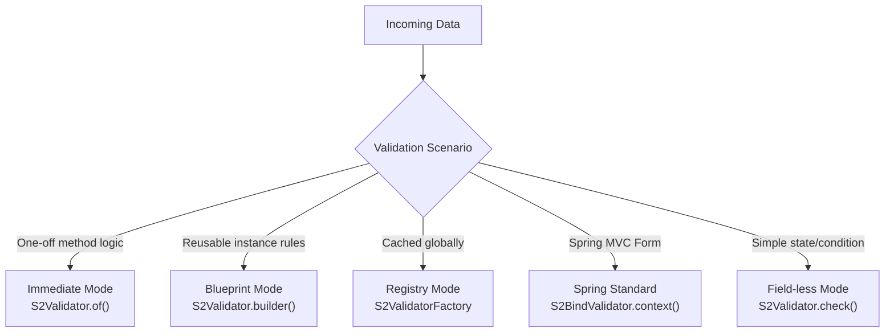
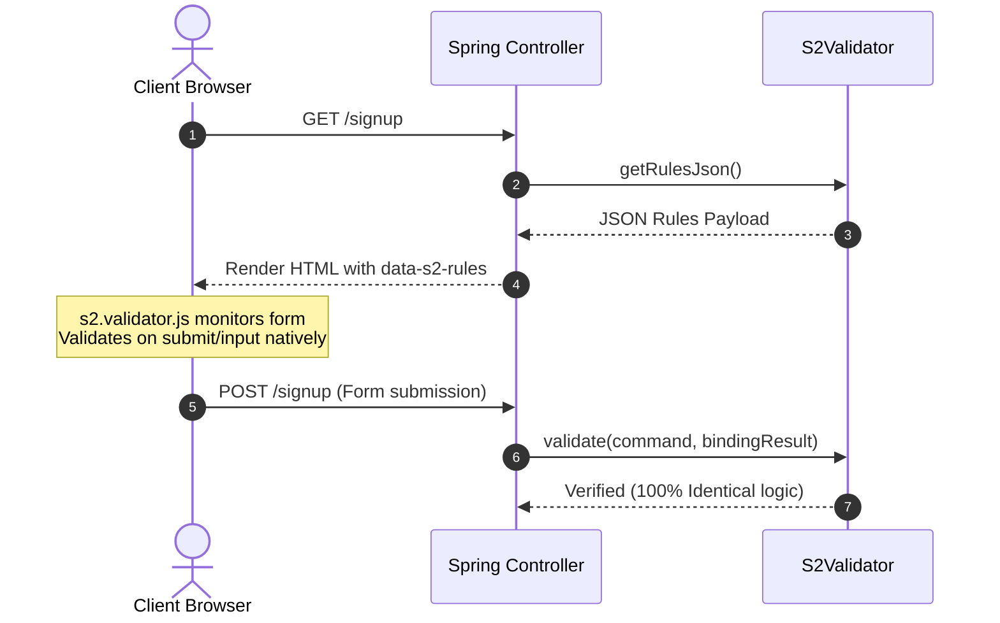

# S2Util User Manual 🚀

🌐 **English** | [한국어](MANUAL.ko.md)

> **Write Once, Validate Anywhere.**
> S2Util is a unified utility ecosystem designed to harmonize Server (Java) and Client (JavaScript) validation while providing near-native object manipulation, intelligent caching, high-performance thread management, and secure dynamic query generation.

---

## 📑 Table of Contents

1. [Installation & Infrastructure](#1-installation--infrastructure)
   - [1-1. Dependencies & Components](#1-1-dependencies--components)
   - [1-2. S2Validator Static Analysis Plugin & Dead Code Detection](#1-2-s2validator-static-analysis-plugin--dead-code-detection)
   - [1-3. Global Configuration (ResourceBundle)](#1-3-global-configuration-resourcebundle)
2. [S2Validator: Strategic Validation Patterns](#2-s2validator-strategic-validation-patterns)
   - [A. Pattern: Immediate Mode](#a-pattern-immediate-mode)
   - [B. Pattern: Blueprint Mode](#b-pattern-blueprint-mode)
   - [C. Pattern: Registry Mode](#c-pattern-registry-mode)
   - [D. Pattern: Spring Standard Alignment](#d-pattern-spring-standard-alignment)
   - [E. Pattern: Field-less Condition Check Mode](#e-pattern-field-less-condition-check-mode)
3. [Comprehensive Rules & Conditional Logic](#3-comprehensive-rules--conditional-logic)
   - [3-1. 30+ Built-in Rules (S2RuleType)](#3-1-30-built-in-rules-s2ruletype)
   - [3-2. Conditional Validation (when & and)](#3-2-conditional-validation-when--and)
   - [3-3. Cross-Field Comparisons](#3-3-cross-field-comparisons)
4. [Messaging & Internationalization (i18n)](#4-messaging--internationalization-i18n)
   - [4-1. Inline Localization (.en, .ko, .message)](#4-1-inline-localization-en-ko-message)
   - [4-2. Smart Korean Particle Handling](#4-2-smart-korean-particle-handling)
5. [Advanced Validation Mechanics](#5-advanced-validation-mechanics)
   - [5-1. Object Graph Navigation (Dot, Bracket, Wildcard)](#5-1-object-graph-navigation-dot-bracket-wildcard)
   - [5-2. Recursive & Compositional Validation (EACH, NESTED)](#5-2-recursive--compositional-validation-each-nested)
   - [5-3. Custom Logic: Predicate & BiPredicate (Server-Only)](#5-3-custom-logic-predicate--bipredicate-server-only)
6. [Unified Integration: Server-Client Synchronization](#6-unified-integration-server-client-synchronization)
   - [6-1. End-to-End Implementation Example](#6-1-end-to-end-implementation-example)
   - [6-2. Technical Architecture (s2.validator.js)](#6-2-technical-architecture-s2validatorjs)
7. [S2Jpql: Secure Dynamic Query Builder](#7-s2jpql-secure-dynamic-query-builder)
   - [7-1. Template-Based Dynamic JPQL](#7-1-template-based-dynamic-jpql)
   - [7-2. Pagination Support](#7-2-pagination-support)
   - [7-3. Security Architecture: SQL Injection Prevention](#7-3-security-architecture-sql-injection-prevention)
8. [S2Copier: Zero-Reflection High-Performance Object Mapping](#8-s2copier-zero-reflection-high-performance-object-mapping)
   - [8-1. MethodHandle-Powered Mapping](#8-1-methodhandle-powered-mapping)
   - [8-2. Selective Updates & JPA Dirty Checking](#8-2-selective-updates--jpa-dirty-checking)
9. [S2Core Toolkit: Essential Utilities](#9-s2core-toolkit-essential-utilities)
   - [9-1. Dynamic Property Access (S2Util)](#9-1-dynamic-property-access-s2util)
   - [9-2. Intelligent Dual-Mode Caching (S2Cache)](#9-2-intelligent-dual-mode-caching-s2cache)
   - [9-3. Version-Adaptive Threading (S2ThreadUtil)](#9-3-version-adaptive-threading-s2threadutil)
   - [9-4. Optimized String Utilities (S2StringUtil)](#9-4-optimized-string-utilities-s2stringutil)

---

## 1. Installation & Infrastructure

### 1-1. Dependencies & Components

#### 🎯 **Option A: All-in-One Distribution (Recommended)**

Add a single dependency to access all modules (`s2-core`, `s2-validator`, and `s2-jpa`) pre-integrated:

**[Gradle]**

```groovy
dependencies {
    implementation 'io.github.devers2:s2-util:1.2.0'
}
```

**[Maven]**

```xml
<dependency>
    <groupId>io.github.devers2</groupId>
    <artifactId>s2-util</artifactId>
    <version>1.2.0</version>
</dependency>
```

---

#### 🧩 **Option B: Selective & Lightweight Modules**

For minimal footprint, declare only the specific sub-modules your application requires:

| Module                     | Dependency Coordinate            | Transitive Inclusion             | Key Capabilities                              |
| :------------------------- | :------------------------------- | :------------------------------- | :-------------------------------------------- |
| **S2Validator**            | `io.github.devers2:s2-validator` | Automatically includes `s2-core` | Server-client synchronized validation engine  |
| **S2BindValidator**        | `io.github.devers2:s2-validator` | Automatically includes `s2-core` | Seamless mapping to Spring `BindingResult`    |
| **S2Jpql**                 | `io.github.devers2:s2-jpa`       | Automatically includes `s2-core` | Safe template-based dynamic query builder     |
| **S2Copier**               | `io.github.devers2:s2-core`      | Zero external dependencies       | Fast reflection-free DTO/Entity object copy   |
| **S2Cache / S2ThreadUtil** | `io.github.devers2:s2-core`      | Zero external dependencies       | High-performance cache & virtual thread tools |

```groovy
dependencies {
    // 1. Validation only
    implementation 'io.github.devers2:s2-validator:1.2.0'

    // 2. JPA dynamic queries only
    implementation 'io.github.devers2:s2-jpa:1.2.0'

    // 3. Core utilities & copier only (lightest)
    implementation 'io.github.devers2:s2-core:1.2.0'
}
```

---

### 1-2. S2Validator Static Analysis Plugin & Dead Code Detection ✨

**Catch Typos & Dead Code at Build Time.** The companion Gradle plugin analyzes AST (Abstract Syntax Tree) during Gradle build tasks before `compileJava`:

1. **Compile-Time Field Validation**: Checks if `.field("fieldName")` actually exists in target DTO classes.
2. **Chaining Completeness Check (Dead Code Detection)**:
   - `S2Validator.of()` chains **must** end with `.validate()`
   - `S2Validator.builder()` chains **must** end with `.build()`
   - `S2Validator.check()` chains **must** end with `.validate()`
   - Incomplete chains are flagged as build failures because incomplete validation is silent **dead code**.

**[settings.gradle]**

```groovy
pluginManagement {
    repositories {
        mavenCentral()
    }
}
```

**[build.gradle]**

```groovy
plugins {
    id 'io.github.devers2.validator' version '1.1.3'
}
```

> [!IMPORTANT]
> Field name static analysis is active when using Generic types (e.g., `S2Validator.<UserDTO>builder()`).

---

### 1-3. Global Configuration (ResourceBundle) - [Optional]

Register a global resource bundle for centralized error messages:

```java
// Configure bundle name from messages.properties
S2BindValidator.setValidationBundle("messages");

// Usage with message keys:
// messages.properties -> err.required={0|is/are} required.
.field("id", "User ID").rule(S2RuleType.REQUIRED, null, "err.required")
```

---

## 2. S2Validator: Strategic Validation Patterns

S2Validator provides 5 distinct execution patterns tailored for various scenarios:



### A. Pattern: Immediate Mode

**Usage:** `S2Validator.of(target, [failFast])`

Ideal for quick, one-off validation within service or controller methods.

```java
// 1. Exception Mode (Default: throws S2RuntimeException upon failure)
S2Validator.of(userInput)
    .field("email").rule(S2RuleType.REQUIRED).rule(S2RuleType.EMAIL)
    .validate();

// 2. Boolean Mode (Returns boolean instead of throwing exception)
boolean isValid = S2Validator.of(userInput, false)
    .field("age").rule(S2RuleType.MIN_VALUE, 20)
    .validate();
```

### B. Pattern: Blueprint Mode

**Usage:** `S2Validator.builder()`

Defines a reusable, immutable, thread-safe validator schema.

```java
// Define reusable validation schema once
S2Validator<UserDTO> schema = S2Validator.<UserDTO>builder()
    .field("id", "User ID").rule(S2RuleType.REQUIRED)
    .field("email", "Email").rule(S2RuleType.EMAIL)
    .build();

// Execute repeatedly on multiple instances
schema.validate(userA);
schema.validate(userB);
```

### C. Pattern: Spring Standard Alignment (Recommended)

**Usage:** `S2BindValidator.of(validator)`

Seamlessly integrates with Spring MVC and automatically populates `BindingResult`. By passing the validator instance directly, it completely avoids global registry key collisions, memory growth, and test isolation concerns.

```java
// Recommended: Define as a static constant or Spring Bean in controller
private static final S2Validator<UserDTO> USER_VALIDATOR = S2Validator.<UserDTO>builder()
    .field("name").rule(S2RuleType.REQUIRED)
    .build();

@PostMapping("/join")
public String join(@ModelAttribute UserDTO user, BindingResult result) {
    S2BindValidator.of(USER_VALIDATOR).validate(user, result);

    if (result.hasErrors()) {
        return "joinForm"; // Native Spring MVC error handling
    }
    return "redirect:/success";
}
```

### D. Pattern: Registry Mode (Optional Global Cache)

**Usage:** `S2ValidatorFactory.getOrRegister()` / `S2BindValidator.context(key, supplier)`

Provides global thread-safe caching. The construction logic executes only once. Supplier class collisions on the same key trigger a `WARN` log, and tests can reset state via `S2Validator.resetAll()` or `S2ValidatorFactory.clear()`.

```java
S2Validator<UserDTO> validator = S2ValidatorFactory.getOrRegister("JOIN_RULES", () ->
    S2Validator.<UserDTO>builder()
        .field("name").rule(S2RuleType.REQUIRED)
        .build()
);
```

### E. Pattern: Single Value & Condition Check Mode

**Usage:** `S2Validator.check(value, [label])` / `S2Validator.check(condition, [errorCode])`

Validates individual variables, values, or arbitrary business conditions without needing an enclosing DTO or Map:

```java
// 1) Single Value - Boolean Mode (returns true/false without throwing exceptions)
boolean isValidEmail = S2Validator.check("user@example.com")
    .rule(S2RuleType.REQUIRED)
    .rule(S2RuleType.EMAIL)
    .validate();

// 2) Single Value - Exception Mode with Label (throws S2RuntimeException on failure)
S2Validator.check(userInput, "User Name")
    .rule(S2RuleType.REQUIRED)
    .rule(S2RuleType.MIN_LENGTH, 2)
    .validate();

// 3) Pure Condition Expression Mode
S2Validator.check(order.isPayable())
    .en("The order is not in a payable status.")
    .ko("결제 가능한 주문 상태가 아닙니다.")
    .validate();
```

---

## 3. Comprehensive Rules & Conditional Logic

### 3-1. 30+ Built-in Rules (S2RuleType)

| Category               | Available Rule Types                                                                  |
| :--------------------- | :------------------------------------------------------------------------------------ |
| **Basic Constraints**  | `REQUIRED`, `ASSERT_TRUE`, `ASSERT_FALSE`, `EQUALS_FIELD`                             |
| **Length & Bounds**    | `LENGTH`, `MIN_LENGTH`, `MAX_LENGTH`, `MIN_BYTE`, `MAX_BYTE`                          |
| **Numeric Checks**     | `NUMBER`, `MIN_VALUE`, `MAX_VALUE`                                                    |
| **Format Validation**  | `EMAIL`, `URL`, `INTERNATIONAL_TEL_NO`, `PASSWORD`, `REGEX`                           |
| **Region-Specific** 🇰🇷 | `TEL_NO`, `MPHONE_NO`, `ZIP`, `BIZRNO`, `JUMIN`, `NWINO`, `PASSWORD_ANSWR`            |
| **Date & Time**        | `DATE`, `DATE_AFTER`, `DATE_BEFORE`                                                   |
| **Text & Content**     | `TEXT_INTACT`, `TEXT_COMBINE`, `EACH`, `NESTED`                                       |

#### Key Security & Formatting Rules

- **`PASSWORD` (Modern Standard Compliance)**:
  - Requires a 3-way combination: English letters (`a-zA-Z`), numbers (`0-9`), and special characters (`!@#$%^&*()_+-=[]{};':"\|,.<>/?~```).
  - Length: **8 to 64 characters** (aligned with KISA and modern security guidelines).
  - *Custom Password Policy*: For alternative rules (e.g., requiring uppercase), use `S2RuleType.REGEX`:
    ```java
    // Example: Min 8 chars, at least 1 uppercase, 1 lowercase, 1 number, 1 special char
    .field("password", "Password")
        .rule(S2RuleType.REGEX, "^(?=.*[a-z])(?=.*[A-Z])(?=.*\\d)(?=.*[@$!%*?&])[A-Za-z\\d@$!%*?&]{8,}$")
        .en("Password must include uppercase, lowercase, numbers, and special characters.");
    ```
- **`JUMIN` (Resident Registration Number — Smart Hybrid Policy)**:
  - **Born before October 2020**: Enforces strict Modulo 11 checksum verification.
  - **Born in/after October 2020** (or adults who were reissued/assigned a new number after this date): Due to the discontinuation of regional assignment checksums, the checksum is safely bypassed while calendar dates (leap years, month/day validity) and gender codes (1–8, 9, 0) are strictly validated.

### 3-2. Conditional Validation (`when` & `and`)

Apply rules conditionally based on other field values:

```java
S2Validator.<PaymentDTO>builder()
    .field("paymentMethod").rule(S2RuleType.REQUIRED)
    // Field 'cardNumber' is required ONLY WHEN paymentMethod == "CARD"
    .field("cardNumber")
        .when("paymentMethod", "CARD")
        .rule(S2RuleType.REQUIRED)
        .rule(S2RuleType.LENGTH, 16)
    // Multiple conditions with and()
    .field("taxId")
        .when("paymentMethod", "INVOICE")
        .and("isBusiness", true)
        .rule(S2RuleType.REQUIRED)
    .build();
```

### 3-3. Cross-Field Comparisons

Easily compare two fields within the same target object:

```java
S2Validator.<RegisterDTO>builder()
    // Password confirmation match
    .field("confirmPassword")
        .rule(S2RuleType.EQUALS_FIELD, "password")
        .en("Passwords do not match.")
    // Date range verification
    .field("endDate")
        .rule(S2RuleType.DATE_AFTER, "startDate")
        .en("End date must be after start date.")
    .build();
```

---

## 4. Messaging & Internationalization (i18n)

### 4-1. Inline Localization (`.en`, `.ko`, `.message`)

Attach language-specific messages directly in the builder chain:

```java
.field("age", "Age")
    .rule(S2RuleType.MIN_VALUE, 19)
    .en("Age must be at least 19.")
    .ko("만 19세 이상이어야 합니다.")
    .message(Locale.JAPAN, "19歳以上である必要があります。")
```

### 4-2. Smart Korean Particle Handling

S2Util automatically selects grammatically correct Korean particles (`은/는`, `이/가`, `을/를`, `과/와`) by analyzing the batchim (terminal consonants) of the field label:

```java
// Automatically outputs: "아이디는 필수입니다." (no batchim -> 는)
.field("id", "아이디").ko("{0|은/는} 필수입니다.")

// Automatically outputs: "이름은 필수입니다." (batchim -> 은)
.field("name", "이름").ko("{0|은/는} 필수입니다.")
```

---

## 5. Advanced Validation Mechanics

### 5-1. Object Graph Navigation (Dot, Bracket, Wildcard)

Navigate deeply nested DTOs and collections effortlessly:

- **Dot Notation (`.`)**: Object traversal (e.g., `user.profile.address.zipCode`)
- **Bracket Indexing (`[n]`)**: Specific collection/array item (e.g., `orders[0].id`)
- **Wildcard (`[]`)**: Validate every item in a list (e.g., `cart.items[].price`)

### 5-2. Recursive & Compositional Validation (EACH, NESTED)

```java
// 1. Sub-validator blueprint
S2Validator<ItemDTO> itemValidator = S2Validator.<ItemDTO>builder()
    .field("name").rule(S2RuleType.REQUIRED)
    .field("price").rule(S2RuleType.MIN_VALUE, 0)
    .build();

// 2. Composed in parent validator
S2Validator.<OrderDTO>builder()
    .field("orderId").rule(S2RuleType.REQUIRED)
    .field("items").rule(S2RuleType.EACH, itemValidator) // Validates every list item
    .field("shippingInfo").rule(S2RuleType.NESTED, shippingValidator) // Validates nested object
    .build();
```

### 5-3. Custom Logic: Predicate & BiPredicate (Server-Only)

Inject custom business lambdas when built-in rule types are not sufficient:

```java
// 1) Single-field Predicate: validates only the field value
.field("age", "Age")
    .rule((Integer val) -> val != null && val >= 19)
    .en("Must be 19 or older.")

// 2) Cross-field BiPredicate: inspects both the field value and the root object
.field("deliveryDate", "Delivery Date")
    .rule(S2RuleType.REQUIRED)
    .rule((val, target) -> {
        LocalDate delivery = (LocalDate) val;
        LocalDate order = S2Util.getValue(target, "orderDate");
        return order != null && delivery.isAfter(order);
    })
    .en("Delivery date must be later than order date.")

// 3) Include empty values: runs lambda even when the value is null or empty
.field("backupEmail", "Backup Email")
    .rule((String val) -> val != null && !val.endsWith("@disposable.com"))
    .includeEmpty()
    .en("Disposable email addresses are not allowed.")
```

> ⚠️ **Server-Only Validation Rule**:
> Java lambdas (`Predicate`, `BiPredicate`) are JVM runtime bytecode objects and **cannot be serialized to JSON** for `s2.validator.js`.
> Therefore, custom lambda rules **execute exclusively on the server side**.
> If a rule must be enforced on both client and server, use [`S2RuleType.REGEX`](#3-core-rules-catalog) or built-in rules.

---

## 6. Unified Integration: Server-Client Synchronization

**"Define on the server once, enforce everywhere."** Export your server-side ruleset to JSON and let the frontend validate forms natively.



### 6-1. End-to-End Implementation Example

#### 1. Define Shared Rules on Server

```java
private S2Validator<UserCommand> signupRules() {
    return S2Validator.<UserCommand>builder()
        .field("userId", "User ID").rule(S2RuleType.REQUIRED)
        .field("password", "Password").rule(S2RuleType.REQUIRED).rule(S2RuleType.MIN_LENGTH, 8)
        .field("confirmPassword", "Confirm Password")
            .rule(S2RuleType.REQUIRED)
            .rule(S2RuleType.EQUALS_FIELD, "password")
            .en("Passwords do not match.")
        .build();
}
```

#### 2. Pass JSON in Controller (GET)

```java
@GetMapping("/signup")
public String signupPage(Model model) {
    String rules = S2BindValidator.context("signup", this::signupRules).getRulesJson();
    model.addAttribute("rules", rules);
    return "signup";
}
```

#### 3. Attach to HTML Form in View

```html
<form id="signupForm" th:data-s2-rules="${rules}">
  <input name="userId" type="text" />
  <input name="password" type="password" />
  <input name="confirmPassword" type="password" />
  <button type="submit">Register</button>
</form>

<script type="module">
  import '/s2-util/js/s2.validator.js';
</script>
```

#### 4. Validate on Server (POST)

```java
@PostMapping("/signup")
public String signup(@ModelAttribute("command") UserCommand command, BindingResult result) {
    S2BindValidator.context("signup", this::signupRules).validate(command, result);
    if (result.hasErrors()) {
        return "signup";
    }
    return "redirect:/welcome";
}
```

### 6-2. Technical Architecture (`s2.validator.js`)

- **Built-in Resource**: `s2.validator.js` is packaged directly inside `s2-validator.jar` at `META-INF/resources/s2-util/js/` (Servlet 3.0+ static resource auto-discovery).
- **Zero Frontend Dependencies**: Vanilla ES6 JavaScript without requiring external libraries (No jQuery/React/Vue lock-in).
- **Auto-binding**: Automatically observes forms marked with `data-s2-rules` and handles validation on submit and real-time input.
- **Hidden Input & Custom Widget Error Proxy (`{fieldName}_error`)**:
  Hidden inputs (`<input type="hidden">`) or custom UI elements cannot display native browser tooltips. Adding a proxy element named `{fieldName}_error` (e.g., `<span id="termsAgreed_error" class="error"></span>`) enables `s2.validator.js` to automatically inject the error message text into it:
  ```html
  <input type="hidden" name="termsAgreed" value="" />
  <!-- Error message will be automatically populated here upon validation failure -->
  <span id="termsAgreed_error" class="error-msg"></span>
  ```
- **Manual AJAX / Fetch Validation**:
  ```javascript
  import { S2Validator } from '/s2-util/js/s2.validator.js';
  const errors = S2Validator.validate('#signupForm');
  if (Object.keys(errors).length > 0) {
      // Abort submission and handle errors
      return;
  }
  ```

---

## 7. S2Jpql: Secure Dynamic Query Builder

Build clean, dynamic JPA queries using Java Text Blocks (`"""`), with strict separation between SQL clauses and parameter values.

### 7-1. Template-Based Dynamic JPQL

```java
String jpql = """
    SELECT p
    FROM Product p
    WHERE 1=1
        {{=cond_name}}
        {{=cond_price}}
    {{=sort}}
""";

return S2Jpql.from(em).type(Product.class).query(jpql)
    .bindClause("cond_name", name, "AND p.name LIKE :name")
        .bindParameter("name", name, LikeMode.ANYWHERE)
    .bindClause("cond_price", price, "AND p.price >= :price")
        .bindParameter("price", price)
    .bindOrderBy("sort", sort)
    .build().getResultList();
```

### 7-2. Pagination Support

```java
// Direct pagination (offset, limit)
S2Jpql.from(em).type(Product.class).query(jpql)
    .limit(0, 20) // First page: rows 0..19
    .build().getResultList();

// Conditional pagination: applies only when condition is true
S2Jpql.from(em).type(Product.class).query(jpql)
    .limit(pageable != null, pageNumber * pageSize, pageSize)
    .build().getResultList();
```

### 7-3. Security Architecture: SQL Injection Prevention

> [!WARNING]
> **Strict Architectural Separation:**
>
> - `bindClause()` is **EXCLUSIVELY** for conditionally including static SQL clause fragments.
> - `bindParameter()` is **EXCLUSIVELY** for binding dynamic parameter values safely.
>
> 1. **Clauses MUST be hardcoded**: Never concatenate user input into clause strings.
> 2. **Values go through bindParameter()**: Never inject dynamic variables via `String.format` or `+`.

```java
// ✅ SAFE: Clause is hardcoded string, value is bound via bindParameter
.bindClause("cond_name", userInput, "AND p.name LIKE :name")
    .bindParameter("name", userInput, LikeMode.ANYWHERE)

// ❌ DANGEROUS: Concatenating input into clause creates SQL Injection!
.bindClause("cond", userInput, "AND p.name LIKE '%" + userInput + "%'")
```

---

## 8. S2Copier: Zero-Reflection High-Performance Object Mapping

Achieves maximum throughput between Entities and DTOs using cached `MethodHandle` call sites instead of standard slow Java reflection.

### 8-1. MethodHandle-Powered Mapping

```java
// Fast property copy without reflection overhead
UserDTO dto = S2Copier.from(userEntity).to(UserDTO.class);
```

### 8-2. Selective Updates & JPA Dirty Checking

```java
// Partial update for PATCH requests
S2Copier.from(requestDto)
    .exclude("id", "createdAt")      // Exclude sensitive fields
    .map("nickName", "displayName")  // Map differing property names
    .ignoreNulls()                   // Skip nulls: triggers JPA Dirty Checking cleanly
    .to(existingEntity);
```

---

## 9. S2Core Toolkit: Essential Utilities

### 9-1. Dynamic Property Access (`S2Util`)

Access and mutate fields across Maps, Records, Arrays, Lists, and DTOs:

```java
// Read values via dot/bracket notation
String city = S2Util.getValue(user, "address.city");
String role = S2Util.getValue(user, "roles[0].name");

// Mutate properties dynamically
S2Util.setValue(user, "address.city", "Seoul");
```

### 9-2. Intelligent Dual-Mode Caching (`S2Cache`)

- **Default (Zero-Dependency)**: `S2OptimisticCache` provides lock-free reads and optimistic atomic writes.
- **Enterprise Mode (Caffeine)**: Seamlessly enables **Caffeine W-TinyLFU** when present on the classpath.
- **Verification**: Check active cache engine via `S2Cache.isCaffeineEnabled()`.

### 9-3. Version-Adaptive Threading (`S2ThreadUtil`)

- **Java 21+**: Automatically provisions **Virtual Threads** for maximum I/O concurrency without OS thread overhead.
- **Java 17**: Automatically provisions optimized platform thread pools.
- **Unified API**: `S2ThreadUtil.getCommonExecutor()` or `S2ThreadUtil.newExecutor(maxThreads)`.

### 9-4. Optimized String Utilities (`S2StringUtil`)

- **Pattern Caching**: `S2StringUtil.replaceAll()` caches compiled regex patterns to eliminate repeated `Pattern.compile()` overhead.
- **Sanitization**: `S2StringUtil.sanitizeInput()` strips control characters.
- **Korean Particles**: `S2StringUtil.appendJosa()` programmatically appends proper Korean grammar particles.

---

[//]: # 'S2_DEPS_INFO_START'

---

**To use certain functionalities (e.g., S2BindValidator), the end-user project must explicitly add the following dependencies to be available at runtime.** Failure to include these dependencies will result in a `java.lang.NoClassDefFoundError` at runtime.

**[For Gradle Users]**

```groovy
dependencies {
    // Essential runtime dependencies for optional functionalities
    implementation 'com.github.ben-manes.caffeine:caffeine:3.2.4'
    implementation 'org.springframework:spring-context:6.2.19'
    implementation 'jakarta.persistence:jakarta.persistence-api:3.2.0'
}
```

[//]: # 'S2_DEPS_INFO_END'

s2-util Version: 1.2.0 (2026-09-22)
