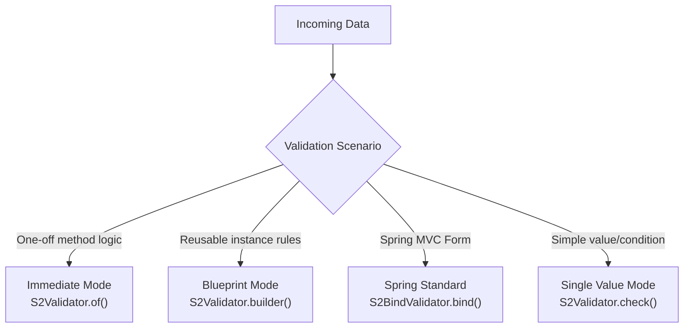
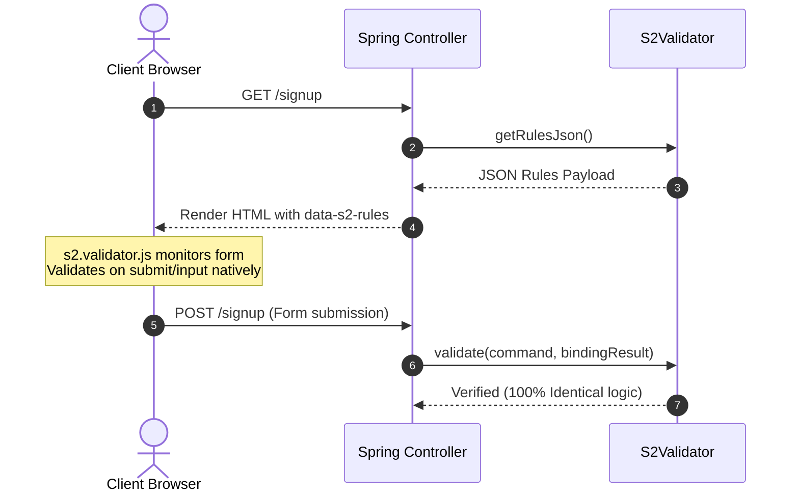

# S2Util User Manual 🚀

🌐 **English** | [한국어](MANUAL.ko.md)

> **Write Once, Validate Anywhere.**
> S2Util is a unified utility ecosystem that validates on the server (Java) and in the browser (JavaScript) with the same rules, and provides MethodHandle-based object mapping, caching, thread utilities and safe dynamic JPQL generation.

---

## 📑 Table of Contents

1. [Installation & Infrastructure](#1-installation--infrastructure)
   - [1-1. Dependencies & Components](#1-1-dependencies--components)
   - [1-2. S2Validator Static Analysis Plugin & Dead Code Detection](#1-2-s2validator-static-analysis-plugin--dead-code-detection-)
   - [1-3. Global Configuration (ResourceBundle)](#1-3-global-configuration-resourcebundle---optional)
   - [1-4. Spring Boot Auto-Configuration](#1-4-spring-boot-auto-configuration---optional)
2. [S2Validator: Strategic Validation Patterns](#2-s2validator-strategic-validation-patterns)
   - [A. Pattern: Immediate Mode](#a-pattern-immediate-mode)
   - [B. Pattern: Blueprint Mode](#b-pattern-blueprint-mode)
   - [C. Pattern: Spring Standard Alignment (Recommended)](#c-pattern-spring-standard-alignment-recommended)
   - [D. Pattern: Single Value & Condition Check Mode](#d-pattern-single-value--condition-check-mode)
3. [Comprehensive Rules & Conditional Logic](#3-comprehensive-rules--conditional-logic)
   - [3-1. 30+ Built-in Rules (S2RuleType)](#3-1-30-built-in-rules-s2ruletype)
   - [3-2. Conditional Validation (when & and)](#3-2-conditional-validation-when--and)
   - [3-3. Cross-Field Comparisons](#3-3-cross-field-comparisons)
4. [Messaging & Internationalization (i18n)](#4-messaging--internationalization-i18n)
   - [4-1. Inline Localization (.en, .ko, .message)](#4-1-inline-localization-en-ko-message)
   - [4-2. Smart Korean Particle Handling](#4-2-smart-korean-particle-handling)
5. [Advanced Validation Mechanics](#5-advanced-validation-mechanics)
   - [5-1. Object Graph Navigation (Dot, Bracket, Wildcard)](#5-1-object-graph-navigation-dot-bracket-wildcard)
   - [5-2. Recursive & Compositional Validation (EACH, NESTED)](#5-2-recursive--compositional-validation-each-nested)
   - [5-3. Custom Logic: Predicate & BiPredicate (Server-Only)](#5-3-custom-logic-predicate--bipredicate-server-only)
   - [5-4. Building a Validator from Rules JSON (fromJson)](#5-4-building-a-validator-from-rules-json-fromjson)
6. [Unified Integration: Server-Client Synchronization](#6-unified-integration-server-client-synchronization)
   - [6-1. End-to-End Implementation Example](#6-1-end-to-end-implementation-example)
   - [6-2. Technical Architecture (s2.validator.js)](#6-2-technical-architecture-s2validatorjs)
7. [S2Jpql: Secure Dynamic Query Builder](#7-s2jpql-secure-dynamic-query-builder)
   - [7-1. Template-Based Dynamic JPQL](#7-1-template-based-dynamic-jpql)
   - [7-2. Pagination Support](#7-2-pagination-support)
   - [7-3. Security Architecture: SQL Injection Prevention](#7-3-security-architecture-sql-injection-prevention)
8. [S2Copier: Zero-Reflection High-Performance Object Mapping](#8-s2copier-zero-reflection-high-performance-object-mapping)
   - [8-1. MethodHandle-Powered Mapping](#8-1-methodhandle-powered-mapping)
   - [8-2. Selective Updates & JPA Dirty Checking](#8-2-selective-updates--jpa-dirty-checking)
9. [S2Core Toolkit: Essential Utilities](#9-s2core-toolkit-essential-utilities)
   - [9-1. Dynamic Property Access (S2Util)](#9-1-dynamic-property-access-s2util)
   - [9-2. Intelligent Dual-Mode Caching (S2Cache)](#9-2-intelligent-dual-mode-caching-s2cache)
   - [9-3. Version-Adaptive Threading (S2ThreadUtil)](#9-3-version-adaptive-threading-s2threadutil)
   - [9-4. Optimized String Utilities (S2StringUtil)](#9-4-optimized-string-utilities-s2stringutil)
   - [9-5. Lightweight JSON (S2JsonUtil)](#9-5-lightweight-json-s2jsonutil)

---

## 1. Installation & Infrastructure

### 1-1. Dependencies & Components

#### 🎯 **Option A: All-in-One Distribution (Recommended)**

Add a single dependency to access all modules (`s2-core`, `s2-validator`, and `s2-jpa`) pre-integrated:

**[Gradle]**

```groovy
dependencies {
    implementation 'io.github.devers2:s2-util:2.0.0'
}
```

**[Maven]**

```xml
<dependency>
    <groupId>io.github.devers2</groupId>
    <artifactId>s2-util</artifactId>
    <version>2.0.0</version>
</dependency>
```

---

#### 🧩 **Option B: Selective & Lightweight Modules**

For minimal footprint, declare only the specific sub-modules your application requires:

| Module                     | Dependency Coordinate            | Transitive Inclusion             | Key Capabilities                              |
| :------------------------- | :------------------------------- | :------------------------------- | :-------------------------------------------- |
| **S2Validator**            | `io.github.devers2:s2-validator` | Automatically includes `s2-core` | Server-client synchronized validation engine  |
| **S2BindValidator**        | `io.github.devers2:s2-validator` | Automatically includes `s2-core` | Seamless mapping to Spring `BindingResult`    |
| **S2Jpql**                 | `io.github.devers2:s2-jpa`       | Automatically includes `s2-core` | Safe template-based dynamic query builder     |
| **S2Copier**               | `io.github.devers2:s2-core`      | Zero external dependencies       | Fast reflection-free DTO/Entity object copy   |
| **S2Cache / S2ThreadUtil** | `io.github.devers2:s2-core`      | Zero external dependencies       | High-performance cache & virtual thread tools |

```groovy
dependencies {
    // 1. Validation only
    implementation 'io.github.devers2:s2-validator:2.0.0'

    // 2. JPA dynamic queries only
    implementation 'io.github.devers2:s2-jpa:2.0.0'

    // 3. Core utilities & copier only (lightest)
    implementation 'io.github.devers2:s2-core:2.0.0'
}
```

---

### 1-2. S2Validator Static Analysis Plugin & Dead Code Detection ✨

**Catch Typos & Dead Code at Build Time.** The companion Gradle plugin analyzes AST (Abstract Syntax Tree) during Gradle build tasks before `compileJava`:

1. **Compile-Time Field Validation**: Checks if `.field("fieldName")` actually exists in target DTO classes.
2. **Chaining Completeness Check (Dead Code Detection)**:
   - `S2Validator.of()` chains **must** end with `.validate()`
   - `S2Validator.builder()` chains **must** end with `.build()`
   - `S2Validator.check()` chains **must** end with `.validate()`
   - Incomplete chains are flagged as build failures because incomplete validation is silent **dead code**.
3. **Rule Criterion and Condition Value Check**: literal mistakes such as `.rule(MAX_LENGTH, "abc")`, `.rule(MIN_VALUE, "19살")`, an invalid `REGEX`, a value for a rule that takes none (`.rule(EMAIL, "...")`) or `when(field, GT, "abc")` fail the build. This catches criterion mistakes at compile time without per-rule methods such as `.maxLength(10)`. A comparison field (`EQUALS_FIELD` etc.) missing from the DTO is a warning.

**[settings.gradle]**

```groovy
pluginManagement {
    repositories {
        mavenCentral()
    }
}
```

**[build.gradle]**

```groovy
plugins {
    id 'io.github.devers2.validator' version '2.0.0'
}
```

> [!IMPORTANT]
> Field name static analysis finds the target DTO from an explicit type argument (e.g., `S2Validator.<UserDTO>builder()`) or from the declared type of the `S2Validator.of(dto)` argument.
> The task is skipped as `UP-TO-DATE` when no source changed, and supports the build cache.

---

### 1-3. Global Configuration (ResourceBundle) - [Optional]

Register a global resource bundle for centralized error messages:

```java
// Configure bundle name from messages.properties
S2BindValidator.setValidationBundle("messages");

// Usage with message keys:
// messages.properties -> err.required={0|is/are} required.
.field("id", "User ID").rule(S2RuleType.REQUIRED, null, "err.required")
```

---

### 1-4. Spring Boot Auto-Configuration - [Optional]

In a Spring Boot application, adding s2-validator as a dependency is enough; there is no separate starter.

> **Not required.** If you only use built-in messages or messages set in code (`.message()`, `.ko()`, `.en()`), nothing needs to be configured, and without validation keys in `messages.properties` the auto-configuration changes nothing. Use it to translate or reword validation messages outside the code (`messages.properties`), or to set the bundle and fallback language in `application.yml`.

 Without Spring this configuration is never loaded and the validator works as before (Spring Boot is a compile-only dependency and does not appear in the published POM).

```yaml
s2:
  validator:
    bundle: messages/validation   # validation message bundle (optional)
    default-locale: ko            # fallback language for messages (optional, JVM locale by default)
    use-message-source: true      # look message keys up in Spring's MessageSource first (default true)
    enabled: true                 # false turns the auto-configuration off
```

- **Messages:** message keys (built-in keys such as `valid.err.required`, and keys given with `.rule(type, value, key)`) are looked up in Spring's `MessageSource` first, so defining them in `messages.properties` (`spring.messages.basename`) overrides validation messages. Templates may use josa tokens such as `{0|은/는}`.
  ```properties
  # messages_ko.properties
  valid.err.required={0|을/를} 꼭 입력하세요.
  ```
- **Request language:** `S2BindValidator` reads `LocaleContextHolder`, so it follows Spring MVC's `LocaleResolver` (Accept-Language, cookie, session).
- Lookup order: `MessageSource` → `bundle` → message set on the rule → built-in message.
- The settings are the validator's global settings; they apply when the context starts and are reset when it closes.
- To use another source (a database, for example) without Spring Boot, plug it in with `S2Validator.setMessageResolver((key, locale) -> …)`.

---

## 2. S2Validator: Strategic Validation Patterns

S2Validator provides 4 execution patterns tailored for various scenarios:


```mermaid
flowchart TD
    Req["Incoming Data"] --> Choice{"Validation Scenario"}
    Choice -->|"One-off method logic"| A["Immediate Mode<br>S2Validator.of()"]
    Choice -->|"Reusable instance rules"| B["Blueprint Mode<br>S2Validator.builder()"]
    Choice -->|"Spring MVC Form"| C["Spring Standard<br>S2BindValidator.bind()"]
    Choice -->|"Simple value/condition"| D["Single Value Mode<br>S2Validator.check()"]
```

### A. Pattern: Immediate Mode

**Usage:** `S2Validator.of(target, [failFast])`

Ideal for quick, one-off validation within service or controller methods.

```java
// 1. Exception Mode (Default: throws S2ValidationException upon failure)
S2Validator.of(userInput)
    .field("email").rule(S2RuleType.REQUIRED).rule(S2RuleType.EMAIL)
    .validate();

// 2. Boolean Mode (Returns boolean instead of throwing exception)
boolean isValid = S2Validator.of(userInput, false)
    .field("age").rule(S2RuleType.MIN_VALUE, 20)
    .validate();

// 3. Simple required check: omitting rules applies REQUIRED
S2Validator.of(userInput)
    .field("name", "Name")
    .field("phone", "Phone")
    .validate();
```

#### Required-check policy (intended design)

| Declaration | Empty value | Notes |
|---|---|---|
| `.field("name", "Name")` | **Rejected** | With no rules, `REQUIRED` is applied. Shorthand for a simple required check. |
| `.field("email", "Email").rule(EMAIL)` | **Accepted** | Once any rule is added, only the added rules apply. Format rules skip empty values. |
| `.field("email", "Email").rule(REQUIRED).rule(EMAIL)` | **Rejected** | State `REQUIRED` when the value must also be present. |

- The server and the browser (rules JSON) behave the same.
- Rules that do not skip empty values: `ASSERT_TRUE`/`ASSERT_FALSE`, and custom lambdas with `.includeEmpty()`.
- A field with only custom lambda rules counts as a field with rules, so `REQUIRED` is not applied.
- The implicit check uses the built-in message (`{0} is required.`). To change it per field, state the rule
  (`.rule(S2RuleType.REQUIRED).en("…")`); to change it globally, define the `valid.err.required` key in the
  [global message bundle](#1-3-global-configuration-resourcebundle---optional).

### B. Pattern: Blueprint Mode

**Usage:** `S2Validator.builder()`

Defines a reusable, immutable, thread-safe validator schema.

```java
// Define reusable validation schema once
S2Validator<UserDTO> schema = S2Validator.<UserDTO>builder()
    .field("id", "User ID").rule(S2RuleType.REQUIRED)
    .field("email", "Email").rule(S2RuleType.EMAIL)
    .build();

// Execute repeatedly on multiple instances
schema.validate(userA);
schema.validate(userB);
```

### C. Pattern: Spring Standard Alignment (Recommended)

**Usage:** `S2BindValidator.bind(validator)` — binds a validator built with `S2Validator.builder()` to Spring (unlike `S2Validator.of(target)`, which validates one object immediately)

Seamlessly integrates with Spring MVC and automatically populates `BindingResult`. The validator instance is passed directly, so there is no global state to collide or reset between tests. Building a validator is cheap (well under a microsecond for a typical form), so it may also be built per request; keep it in a constant or Spring bean when the rule definition itself is expensive. Use the same instance (or the same rule-definition method) for the GET form (`getRulesJson()`) and the POST handler (`validate()`) so both apply identical rules.

```java
// Recommended: Define as a static constant or Spring Bean in controller
private static final S2Validator<UserDTO> USER_VALIDATOR = S2Validator.<UserDTO>builder()
    .field("name").rule(S2RuleType.REQUIRED)
    .build();

@PostMapping("/join")
public String join(@ModelAttribute UserDTO user, BindingResult result) {
    S2BindValidator.bind(USER_VALIDATOR).validate(user, result);

    if (result.hasErrors()) {
        return "joinForm"; // Native Spring MVC error handling
    }
    return "redirect:/success";
}
```

#### Choosing how to bind

| Approach | When to use |
|---|---|
| **Field** `private final BoundContext<T> x = S2BindValidator.bind(rules());` | Default. Built once per controller instance and shared by the GET form and the POST handler. |
| **Constructor** `this.x = S2BindValidator.bind(rules());` | The rule definition uses injected dependencies (e.g. a code-list service). |
| **Per call** `S2BindValidator.bind(rules()).validate(...)` | Rules change at runtime (e.g. options loaded from a DB). Building costs ~0.5µs for a typical form. |

> [!WARNING]
> Field initializers run **before** the constructor body. If `rules()` reads a dependency assigned in the constructor or injected with `@Autowired`, it is still `null` there and a field initializer throws `NullPointerException`. Bind in the constructor after the assignment, or bind per call:
>
> ```java
> private final CodeService codeService;
> private final S2BindValidator.BoundContext<SignupCommand> signup;
>
> public SignupController(CodeService codeService) {
>     this.codeService = codeService;
>     this.signup = S2BindValidator.bind(signupRules()); // signupRules() may use codeService here
> }
> ```

`BoundContext` only holds the validator and reads the request locale on every call, so keeping it in a field is thread-safe.

### D. Pattern: Single Value & Condition Check Mode

**Usage:** `S2Validator.check(value, [label])` / `S2Validator.check(condition, [errorCode])`

Validates individual variables, values, or arbitrary business conditions without needing an enclosing DTO or Map:

```java
// 1) Single Value - Boolean Mode (returns true/false without throwing exceptions)
boolean isValidEmail = S2Validator.check("user@example.com")
    .rule(S2RuleType.REQUIRED)
    .rule(S2RuleType.EMAIL)
    .validate();

// 2) Single Value - Exception Mode with Label (throws S2ValidationException on failure)
S2Validator.check(userInput, "User Name")
    .rule(S2RuleType.REQUIRED)
    .rule(S2RuleType.MIN_LENGTH, 2)
    .validate();

// 3) Pure Condition Expression Mode
S2Validator.check(order.isPayable())
    .en("The order is not in a payable status.")
    .ko("결제 가능한 주문 상태가 아닙니다.")
    .validate();
```

---

## 3. Comprehensive Rules & Conditional Logic

### 3-1. 30+ Built-in Rules (S2RuleType)

| Category               | Available Rule Types                                                                  |
| :--------------------- | :------------------------------------------------------------------------------------ |
| **Basic Constraints**  | `REQUIRED`, `ASSERT_TRUE`, `ASSERT_FALSE`, `EQUALS_FIELD`                             |
| **Length & Bounds**    | `LENGTH`, `MIN_LENGTH`, `MAX_LENGTH`, `MIN_BYTE`, `MAX_BYTE`                          |
| **Numeric Checks**     | `NUMBER`, `MIN_VALUE`, `MAX_VALUE`                                                    |
| **Format Validation**  | `EMAIL`, `URL`, `INTERNATIONAL_TEL_NO`, `PASSWORD`, `REGEX`                           |
| **Region-Specific** 🇰🇷 | `TEL_NO`, `MPHONE_NO`, `ZIP`, `BIZRNO`, `JUMIN`, `NWINO`, `PASSWORD_ANSWR`            |
| **Date & Time**        | `DATE`, `DATE_AFTER`, `DATE_BEFORE`                                                   |
| **Text & Content**     | `TEXT_INTACT`, `TEXT_COMBINE`, `EACH`, `NESTED`                                       |

#### Key Security & Formatting Rules

- **`ASSERT_TRUE` / `ASSERT_FALSE` (checkboxes and consent)**:
  - Empty values (an unchecked checkbox is not submitted) are judged too, so `ASSERT_TRUE` alone is enough for a required consent checkbox.
  - Adding `REQUIRED` as well produces two messages (required + must be checked) when unchecked.
  - The strings `true`/`on` (checked) and `false`/`off`/empty (unchecked) are recognized, so `Map` binding works as well.
- **`PASSWORD` (Modern Standard Compliance)**:
  - Requires a 3-way combination: English letters (`a-zA-Z`), numbers (`0-9`), and special characters (`!@#$%^&*()_+-=[]{};':"\|,.<>/?~```).
  - Length: **8 to 64 characters** (aligned with KISA and modern security guidelines).
  - *Custom Password Policy*: For alternative rules (e.g., requiring uppercase), use `S2RuleType.REGEX`:
    ```java
    // Example: Min 8 chars, at least 1 uppercase, 1 lowercase, 1 number, 1 special char
    .field("password", "Password")
        .rule(S2RuleType.REGEX, "^(?=.*[a-z])(?=.*[A-Z])(?=.*\\d)(?=.*[@$!%*?&])[A-Za-z\\d@$!%*?&]{8,}$")
        .en("Password must include uppercase, lowercase, numbers, and special characters.");
    ```
- **`JUMIN` (Resident Registration Number)**:
  - **Default (`.rule(S2RuleType.JUMIN)`)**: Validates 13 digits (hyphen allowed), a real calendar birth date (leap years, month/day validity), and the gender code (1–8, 9, 0). The check digit (last digit) is not verified.
  - **Checksum (`.rule(S2RuleType.JUMIN, true)`)**: Additionally verifies the legacy Modulo 11 check digit for people born before October 2020.
  - **Why checksum is off by default**: Since October 2020, any newly issued or changed number gets random suffix digits regardless of birth date. A number cannot reveal when it was issued, so the check digit would reject valid numbers of people born earlier who were reissued a number.
- **`BIZRNO` (Business Registration Number)**:
  - **Default (`.rule(S2RuleType.BIZRNO)`)**: Checks the format only: `000-00-00000` or 10 digits.
  - **Check digit (`.rule(S2RuleType.BIZRNO, true)`)**: Also verifies the 10th (check) digit, rejecting made-up numbers that only match the format (e.g., `123-45-67890`). Opt-in because test data often uses made-up numbers.

### 3-2. Conditional Validation (`when` & `and`)

Apply rules conditionally based on other field values:

```java
S2Validator.<PaymentDTO>builder()
    .field("paymentMethod").rule(S2RuleType.REQUIRED)
    // Field 'cardNumber' is required ONLY WHEN paymentMethod == "CARD"
    .field("cardNumber")
        .when("paymentMethod", "CARD")
        .rule(S2RuleType.REQUIRED)
        .rule(S2RuleType.LENGTH, 16)
    // Multiple conditions with and()
    .field("taxId")
        .when("paymentMethod", "INVOICE")
        .and("isBusiness", true)
        .rule(S2RuleType.REQUIRED)
    .build();
```

#### Comparison Operators (`S2Operator`)

`when(field, value)` means "equal". For other comparisons pass an operator. The server and the browser judge them the same way.

```java
.field("guardianName").when("age", S2Operator.LT, 14).rule(S2RuleType.REQUIRED)          // guardian required under 14
.field("reason").when("status", S2Operator.IN, List.of("REJECT", "HOLD")).rule(S2RuleType.REQUIRED)
.field("memo").when("type", S2Operator.NE, "NORMAL").and("amount", S2Operator.GTE, 1000000).rule(S2RuleType.REQUIRED)
.field("phone").when("email", S2Operator.EMPTY).rule(S2RuleType.REQUIRED)                 // phone required without email
```

| Operator | Satisfied when |
|---|---|
| `EQ` (default) | Equal. For a checkbox group, it contains the value. `when(field, null)` means empty |
| `NE` | Not equal (the negation of `EQ`, so an empty value also satisfies it) |
| `GT` `GTE` `LT` `LTE` | Numeric comparison. Only plain numbers count, as with `MIN_VALUE`; empty or non-numeric values such as `"1,000"` do not satisfy it |
| `IN` / `NOT_IN` | Equal to one of the listed values (collection or array) / to none of them. A checkbox group satisfies `IN` if it contains any |
| `EMPTY` / `NOT_EMPTY` | Empty / present. Blank strings and unchecked groups are empty |

- A value that does not fit the operator (`"abc"` for `GT`, a non-list for `IN`) throws `IllegalArgumentException` when the validator is built.
- The condition field is looked up in the current row/object first, then outer objects up to the root (including row conditions such as `items[].type`).

### 3-3. Cross-Field Comparisons

Easily compare two fields within the same target object:

```java
S2Validator.<RegisterDTO>builder()
    // Password confirmation match
    .field("confirmPassword")
        .rule(S2RuleType.EQUALS_FIELD, "password")
        .en("Passwords do not match.")
    // Date range verification
    .field("endDate")
        .rule(S2RuleType.DATE_AFTER, "startDate")
        .en("End date must be after start date.")
    .build();
```

---

## 4. Messaging & Internationalization (i18n)

### 4-1. Inline Localization (`.en`, `.ko`, `.message`)

Attach messages right after a rule in the builder chain. Each call applies to the rule just before it.

| Method | Meaning |
|---|---|
| `.message(template)` | **Default message for every language** that has no language-specific message. Enough for a single-language service. |
| `.message(template, locale)` | Message for one language (`Locale.JAPAN` and `Locale.JAPANESE` are the same: only the language is used). `null` locale = `.message(template)`. |
| `.ko(template)` / `.en(template)` | Shortcuts for `.message(template, Locale.KOREAN)` / `.message(template, Locale.ENGLISH)`. |
| `.rule(type, value, messageKey)` | Look the message up by key in the bundle set with `S2Validator.setValidationBundle(...)` (see 1-3). |

```java
// 1) Single-language service: one default message
.field("name", "이름")
    .rule(S2RuleType.REQUIRED)
    .message("{0|은/는} 꼭 입력해 주세요.")

// 2) Default message + per-language overrides
.field("age", "나이")
    .rule(S2RuleType.MIN_VALUE, 19)
    .message("만 19세 이상이어야 합니다.")               // any language without its own message
    .en("Age must be at least 19.")                    // English requests
    .message("19歳以上である必要があります。", Locale.JAPAN) // Japanese requests

// 3) Message key from the bundle (messages.properties: err.adult={0} must be at least {1}.)
.field("age", "Age")
    .rule(S2RuleType.MIN_VALUE, 19, "err.adult")
```

**Lookup order** (for the request locale):

1. Bundle message for the rule's key (`setValidationBundle` + key)
2. Message for the request language (`.message(template, locale)`, `.ko`, `.en`)
3. Default message (`.message(template)`)
4. Message for the default locale's language (`S2Validator.setDefaultLocale`)
5. Built-in message of the rule (Korean/English)

Placeholders: `{0}` is the field label and `{1}` the rule criterion (e.g. `19`, or the target field's label for `EQUALS_FIELD`). Messages are rendered on the server, so the rules JSON sent to the browser already contains the text for the request locale.

### 4-2. Smart Korean Particle Handling

S2Util automatically selects grammatically correct Korean particles (`은/는`, `이/가`, `을/를`, `과/와`) by analyzing the batchim (terminal consonants) of the field label:

```java
// Automatically outputs: "아이디는 필수입니다." (no batchim -> 는)
.field("id", "아이디").ko("{0|은/는} 필수입니다.")

// Automatically outputs: "이름은 필수입니다." (batchim -> 은)
.field("name", "이름").ko("{0|은/는} 필수입니다.")
```

---

## 5. Advanced Validation Mechanics

### 5-1. Object Graph Navigation (Dot, Bracket, Wildcard)

Navigate deeply nested DTOs and collections effortlessly:

- **Dot Notation (`.`)**: Object traversal (e.g., `user.profile.address.zipCode`)
- **Bracket Indexing (`[n]`)**: Specific collection/array item (e.g., `orders[0].id`)
- **Wildcard (`[]`)**: Validate every item in a list (e.g., `cart.items[].price`)

### 5-2. Recursive & Compositional Validation (EACH, NESTED)

```java
// 1. Sub-validator blueprint
S2Validator<ItemDTO> itemValidator = S2Validator.<ItemDTO>builder()
    .field("name").rule(S2RuleType.REQUIRED)
    .field("price").rule(S2RuleType.MIN_VALUE, 0)
    .build();

// 2. Composed in parent validator
S2Validator.<OrderDTO>builder()
    .field("orderId").rule(S2RuleType.REQUIRED)
    .field("items").rule(S2RuleType.EACH, itemValidator) // Validates every list item
    .field("shippingInfo").rule(S2RuleType.NESTED, shippingValidator) // Validates nested object
    .build();
```

**Referring to outer fields.** Inside a NESTED/EACH sub-validator (and in wildcard rows), a cross-field target (`EQUALS_FIELD`, `DATE_AFTER`, `DATE_BEFORE`) and a `when` condition are looked up in the current object first, then in each outer object up to the root. The browser uses the same order, and the message shows the label declared in the validator that owns the field.

```java
S2Validator.<OrderDTO>builder()
    .field("orderDate", "Order date")
    .field("items", "Items").rule(S2RuleType.EACH, S2Validator.<ItemDTO>builder()
        .field("deliveryDate", "Delivery date").rule(S2RuleType.DATE_AFTER, "orderDate") // root field
        .field("giftMessage", "Gift message").when("giftWrap", true).rule(S2RuleType.REQUIRED) // row field
        .build())
    .build();
// → "Delivery date cannot be earlier than Order date." (a field with the same name in the row wins over the root)
```

**Dynamic rows: keep indices contiguous.** When the user deletes a row, the remaining inputs may be named `items[0]` and `items[2]`. The browser validates only the rows that exist, and a `null` element in a `Map`/`List` target is skipped on the server too. But Spring's data binding to a DTO list auto-grows the list and fills the gap with an **empty object** (`new ItemDTO()`), which the server cannot tell apart from a real empty row, so the server reports `items[1].*` errors for a row that is not on the screen. Renumber the rows after deleting one so the indices stay `0..n-1`, with `S2Validator.reindex(form, collection)`:

```javascript
import { S2Validator } from '/s2-util/js/s2.validator.js';

deleteButton.addEventListener('click', () => {
  row.remove();
  S2Validator.reindex(form, 'items'); // items[0], items[2], items[5] -> items[0], items[1], items[2]
});
// Nested collection: pass its full path, e.g. S2Validator.reindex(form, 'items[0].options')
```

It renames, in document order, the `name` of inputs (including sub-paths such as `items[2].addr.zip` and `{fieldName}_error` proxies) and `data-s2-error-for` attributes; other collections and `id` attributes are left as they are. It is never applied automatically, because indices can be meaningful (e.g. map keys or IDs such as `items[1234]`). If other scripts look inputs up by `name`, let them do so after renumbering.

### 5-3. Custom Logic: Predicate & BiPredicate (Server-Only)

Inject custom business lambdas when built-in rule types are not sufficient:

```java
// 1) Single-field Predicate: validates only the field value
.field("age", "Age")
    .rule((Integer val) -> val != null && val >= 19)
    .en("Must be 19 or older.")

// 2) Cross-field BiPredicate: inspects both the field value and the root object
.field("deliveryDate", "Delivery Date")
    .rule(S2RuleType.REQUIRED)
    .rule((val, target) -> {
        LocalDate delivery = (LocalDate) val;
        LocalDate order = S2Util.getValue(target, "orderDate");
        return order != null && delivery.isAfter(order);
    })
    .en("Delivery date must be later than order date.")

// 3) Include empty values: runs lambda even when the value is null or empty
.field("backupEmail", "Backup Email")
    .rule((String val) -> val != null && !val.endsWith("@disposable.com"))
    .includeEmpty()
    .en("Disposable email addresses are not allowed.")
```

> ⚠️ **Server-Only Validation Rule**:
> Java lambdas (`Predicate`, `BiPredicate`) are JVM runtime bytecode objects and **cannot be serialized to JSON** for `s2.validator.js`.
> Therefore, custom lambda rules **execute exclusively on the server side**.
> If a rule must be enforced on both client and server, use [`S2RuleType.REGEX`](#3-1-30-built-in-rules-s2ruletype) or built-in rules.
> When `getRulesJson()` meets such a rule, it logs an `INFO` notice once per definition site (not per request) so this is visible during development.

### 5-4. Building a Validator from Rules JSON (`fromJson`)

Use it to keep rules in a database or configuration and change them without a redeploy. It reads the shape `getRulesJson()` writes, plus the definition keys `messages` and `key`.

```java
String json = ruleRepository.findJson("signup");   // e.g. rules stored in a database
S2Validator<SignupCommand> validator = S2Validator.fromJson(json);
S2BindValidator.bind(validator).validate(command, bindingResult);   // same as a validator built in code
```

```json
{"schemaVersion": 1, "fields": [
  {"name": "memo", "label": "Memo",
   "rules": [{"type": "MAX_LENGTH", "value": 500,
              "messages": {"ko": "{0|은/는} 500자 이하로 입력하십시오.", "en": "{0} must be at most 500 characters."}}],
   "conditions": [[{"field": "type", "op": "IN", "value": ["A", "B"]}]]},
  {"name": "items", "label": "Items",
   "rules": [{"type": "EACH", "nestedRules": [{"name": "qty", "label": "Qty", "rules": [{"type": "MIN_VALUE", "value": 1}]}]}]}
]}
```

| Level | Keys |
|---|---|
| Field | `name` (required), `label`, `rules`, `conditions`. Without rules it is a required check |
| Rule | `type` (required, `S2RuleType` name), `value` (criterion; the pattern for `REGEX`), `message` (any language), `messages` (language tag → template), `key` (bundle key), `nestedRules` (`NESTED`/`EACH`) |
| Condition | `field`, `op` (`S2Operator` name, default `EQ`), `value`. The outer array is OR, each inner array is AND |

- **Strict:** unknown keys (a `mesage` typo), unknown rule types or operators, criteria that do not fit and an unsupported `schemaVersion` fail with `IllegalArgumentException`; the message names the path (`$.fields[2].rules[0].type`). JSON syntax errors are `S2JsonException`.
- Custom lambda rules are code and cannot be defined in JSON.
- For rules written by hand in a configuration file, pass `Feature.JSON5` to write them in JSON5 (single quotes, unquoted keys, comments, trailing commas).

  ```java
  S2Validator<Map<String, Object>> v = S2Validator.fromJson("""
      { schemaVersion: 1, fields: [
        { name: 'memo', label: 'Memo', rules: [{ type: 'MAX_LENGTH', value: 500 }] },  // memo length limit
      ]}""", S2JsonUtil.Feature.JSON5);
  ```

---

## 6. Unified Integration: Server-Client Synchronization

**"Define on the server once, enforce everywhere."** Export your server-side ruleset to JSON and let the frontend validate forms natively.


```mermaid
sequenceDiagram
    autonumber
    actor User as Client Browser
    participant Controller as Spring Controller
    participant Engine as S2Validator

    User->>Controller: GET /signup
    Controller->>Engine: getRulesJson()
    Engine-->>Controller: JSON Rules Payload
    Controller-->>User: Render HTML with data-s2-rules
    Note over User: s2.validator.js monitors form<br/>Validates on submit/input natively
    User->>Controller: POST /signup (Form submission)
    Controller->>Engine: validate(command, bindingResult)
    Engine-->>Controller: Verified (100% Identical logic)
```

### 6-1. End-to-End Implementation Example

#### 1. Define Shared Rules on Server

```java
private S2Validator<UserCommand> signupRules() {
    return S2Validator.<UserCommand>builder()
        .field("userId", "User ID").rule(S2RuleType.REQUIRED)
        .field("password", "Password").rule(S2RuleType.REQUIRED).rule(S2RuleType.MIN_LENGTH, 8)
        .field("confirmPassword", "Confirm Password")
            .rule(S2RuleType.REQUIRED)
            .rule(S2RuleType.EQUALS_FIELD, "password")
            .en("Passwords do not match.")
        .build();
}

// Bind once; the GET form and the POST handler share it
private final S2BindValidator.BoundContext<UserCommand> signup = S2BindValidator.bind(signupRules());
```

#### 2. Pass JSON in Controller (GET)

```java
@GetMapping("/signup")
public String signupPage(Model model) {
    String rules = signup.getRulesJson();
    model.addAttribute("rules", rules);
    return "signup";
}
```

#### 3. Attach to HTML Form in View

```html
<form id="signupForm" th:data-s2-rules="${rules}">
  <input name="userId" type="text" />
  <input name="password" type="password" />
  <input name="confirmPassword" type="password" />
  <button type="submit">Register</button>
</form>

<script type="module">
  import '/s2-util/js/s2.validator.js';
</script>
```

#### 4. Validate on Server (POST)

```java
@PostMapping("/signup")
public String signup(@ModelAttribute("command") UserCommand command, BindingResult result) {
    signup.validate(command, result);
    if (result.hasErrors()) {
        return "signup";
    }
    return "redirect:/welcome";
}
```

### 6-2. Technical Architecture (`s2.validator.js`)

- **Built-in Resource**: `s2.validator.js` is packaged directly inside `s2-validator.jar` at `META-INF/resources/s2-util/js/` (Servlet 3.0+ static resource auto-discovery).
- **Zero Frontend Dependencies**: Vanilla ES6 JavaScript without requiring external libraries (No jQuery/React/Vue lock-in).
- **Auto-binding**: Automatically observes forms marked with `data-s2-rules` and handles validation on submit and real-time input.
- **Hidden Input & Custom Widget Error Proxy (`{fieldName}_error`)**:
  Hidden inputs (`<input type="hidden">`) or custom UI elements cannot display native browser tooltips. Adding a proxy element named `{fieldName}_error` (e.g., `<span id="termsAgreed_error" class="error"></span>`) enables `s2.validator.js` to automatically inject the error message text into it:
  ```html
  <input type="hidden" name="termsAgreed" value="" />
  <!-- Error message will be automatically populated here upon validation failure -->
  <span id="termsAgreed_error" class="error-msg"></span>
  ```
- **Manual AJAX / Fetch Validation**:
  ```javascript
  import { S2Validator } from '/s2-util/js/s2.validator.js';
  const errors = S2Validator.validate('#signupForm');
  if (Object.keys(errors).length > 0) {
      // Abort submission and handle errors
      return;
  }
  ```
- **Auto-Fallback for Hidden Fields**:
  If no `{fieldName}_error` proxy is found and no element of the field is rendered (`type="hidden"`, or inside a `display:none` container such as a closed tab or accordion), S2Validator creates one temporary 1px transparent anchor so the browser can display a native tooltip instead of failing silently. The anchor is placed right after the hidden field, or after the outermost non-rendered container so that it is itself rendered. Radio/checkbox groups get one anchor per field. The anchor carries the message as `aria-label`, has no `name` (never submitted), and is removed on the next validation or user interaction. This applies to wildcard row fields (`items[].x`) as well.

- **Custom Error Rendering (`setRenderer`)**:
  Instead of the browser's native bubbles, errors can be drawn the application's way (inline messages, toasts, a tab badge). While a renderer is set, native bubbles, `{fieldName}_error` proxies, and hidden-field anchors are not used, so messages for hidden fields appear wherever the renderer puts them. Renderer exceptions are logged and do not change the result: a form with errors is still not submitted. The renderer is global; `setRenderer(null)` restores the native UI.
  ```html
  <input name="email" class="form-control" />
  <div class="invalid-feedback" data-s2-error-for="email"></div>

  <script type="module">
    import { S2Validator } from '/s2-util/js/s2.validator.js';

    // Built-in: adds `is-invalid` to invalid fields, writes the first message into [data-s2-error-for], focuses the first error
    S2Validator.setRenderer(S2Validator.classRenderer()); // options: { invalidClass, messageAttribute, focus }

    // Or a custom renderer (all methods optional)
    S2Validator.setRenderer({
      clear(form) { /* before each validation */ },
      show(form, errors) { showToast(Object.values(errors)[0][0]); }, // errors: { fieldName: [messages] }
      clearField(form, fieldName) { /* the user edited this field */ },
      showField(form, fieldName, messages) { /* live validation: show one field (do not move focus) */ }
    });
  </script>
  ```

- **Live validation (`data-s2-live`, `setLiveMode`)**:
  By default forms are validated on submit only. Add `data-s2-live="blur"` (validate when a field loses focus; a field with an error clears as soon as it is fixed) or `"input"` (on every input) to a form, or set the global default with `S2Validator.setLiveMode('blur')`. Live validation never moves focus or pops up bubbles: with a renderer it updates just that field through `showField`/`clearField`; with the native UI it only sets the field's validity (for `:invalid`/`:user-invalid` CSS) and the bubble appears on submit. Combine it with `classRenderer()` to show messages next to the fields right away. Submit still validates every field.
  ```html
  <form th:data-s2-rules="${rules}" data-s2-live="blur"> ... </form>
  ```

- **Form-free validation (`S2Validator.check(rules, data)`)**:
  Validates plain data without a `<form>`, for apps that render from state (React, Vue) or before sending JSON. It uses the same judgment engine as form validation and accepts nested data (`{ items: [{ qty: 0 }] }`) and flat keys (`{ 'items[0].qty': 0 }`). A field missing from the data is judged as empty, like on the server, and nothing under a missing object or row is validated. Nothing is displayed.
  ```js
  const errors = S2Validator.check(rulesJson, { name: '', items: [{ qty: 0 }] });
  // { name: ['...is required.'], 'items[0].qty': ['...'] }
  ```

---

## 7. S2Jpql: Secure Dynamic Query Builder

Build clean, dynamic JPA queries using Java Text Blocks (`"""`), with strict separation between SQL clauses and parameter values.

### 7-1. Template-Based Dynamic JPQL

```java
String jpql = """
    SELECT p
    FROM Product p
    WHERE 1=1
        {{=cond_name}}
        {{=cond_price}}
    {{=sort}}
""";

return S2Jpql.from(em).type(Product.class).query(jpql)
    .bindClause("cond_name", name, "AND p.name LIKE :name")
        .bindParameter("name", name, LikeMode.ANYWHERE)
    .bindClause("cond_price", price, "AND p.price >= :price")
        .bindParameter("price", price)
    .bindOrderBy("sort", sort)
    .build().getResultList();
```

### 7-2. Pagination Support

```java
// Direct pagination (offset, limit)
S2Jpql.from(em).type(Product.class).query(jpql)
    .limit(0, 20) // First page: rows 0..19
    .build().getResultList();

// Conditional pagination: applies only when condition is true
S2Jpql.from(em).type(Product.class).query(jpql)
    .limit(pageable != null, pageNumber * pageSize, pageSize)
    .build().getResultList();
```

### 7-3. Security Architecture: SQL Injection Prevention

> [!WARNING]
> **Strict Architectural Separation:**
>
> - `bindClause()` is **EXCLUSIVELY** for conditionally including static SQL clause fragments.
> - `bindParameter()` is **EXCLUSIVELY** for binding dynamic parameter values safely.
>
> 1. **Clauses MUST be hardcoded**: Never concatenate user input into clause strings.
> 2. **Values go through bindParameter()**: Never inject dynamic variables via `String.format` or `+`.

```java
// ✅ SAFE: Clause is hardcoded string, value is bound via bindParameter
.bindClause("cond_name", userInput, "AND p.name LIKE :name")
    .bindParameter("name", userInput, LikeMode.ANYWHERE)

// ❌ DANGEROUS: Concatenating input into clause creates SQL Injection!
.bindClause("cond", userInput, "AND p.name LIKE '%" + userInput + "%'")
```

---

## 8. S2Copier: Zero-Reflection High-Performance Object Mapping

Achieves maximum throughput between Entities and DTOs using cached `MethodHandle` call sites instead of standard slow Java reflection.

### 8-1. MethodHandle-Powered Mapping

```java
// Fast property copy without reflection overhead
UserDTO dto = S2Copier.from(userEntity).to(UserDTO.class);
```

### 8-2. Selective Updates & JPA Dirty Checking

```java
// Partial update for PATCH requests
S2Copier.from(requestDto)
    .exclude("id", "createdAt")      // Exclude sensitive fields
    .map("nickName", "displayName")  // Map differing property names
    .ignoreNulls()                   // Skip nulls: triggers JPA Dirty Checking cleanly
    .to(existingEntity);
```

---

## 9. S2Core Toolkit: Essential Utilities

### 9-1. Dynamic Property Access (`S2Util`)

Access and mutate fields across Maps, Records, Arrays, Lists, and DTOs:

```java
// Read values via dot/bracket notation
String city = S2Util.getValue(user, "address.city");
String role = S2Util.getValue(user, "roles[0].name");

// Mutate properties dynamically
S2Util.setValue(user, "address.city", "Seoul");
```

### 9-2. Intelligent Dual-Mode Caching (`S2Cache`)

- **Default (Zero-Dependency)**: `S2OptimisticCache` provides lock-free reads and optimistic atomic writes.
- **Enterprise Mode (Caffeine)**: Seamlessly enables **Caffeine W-TinyLFU** when present on the classpath.
- **Verification**: Check active cache engine via `S2Cache.isCaffeineEnabled()`.

### 9-3. Version-Adaptive Threading (`S2ThreadUtil`)

- **Java 21+**: Automatically provisions **Virtual Threads** for maximum I/O concurrency without OS thread overhead.
- **Java 17**: Automatically provisions optimized platform thread pools.
- **Unified API**: `S2ThreadUtil.getCommonExecutor()` or `S2ThreadUtil.newExecutor(maxThreads)`.

### 9-4. Optimized String Utilities (`S2StringUtil`)

- **Pattern Caching**: `S2StringUtil.replaceAll()` caches compiled regex patterns to eliminate repeated `Pattern.compile()` overhead.
- **Sanitization**: `S2StringUtil.sanitizeInput()` strips control characters.
- **Korean Particles**: `S2StringUtil.appendJosa()` programmatically appends proper Korean grammar particles.

### 9-5. Lightweight JSON (`S2JsonUtil`)

Writes and reads JSON and maps it to and from plain Java types without external dependencies. It is deliberately small; use Jackson for annotations, polymorphism or custom serializers.

```java
String json = S2JsonUtil.toJson(order);                          // records, POJOs, maps, lists, java.time ...
Order order = S2JsonUtil.fromJson(json, Order.class);            // canonical constructor for records, no-arg for POJOs
List<Item> items = S2JsonUtil.fromJsonList(arrayJson, Item.class);
Map<String, Object> tree = S2JsonUtil.parseObject(json);         // Map / List / String / Long / Double / Boolean
Object relaxed = S2JsonUtil.parse(text, Feature.ALLOW_JAVA_COMMENTS, Feature.ALLOW_TRAILING_COMMA);
```

- **Strict standard JSON by default.** Comments, single quotes, trailing commas and so on are enabled through `Feature`.
- **For hand-written configuration** use `Feature.JSON5`, which accepts the published [JSON5](https://spec.json5.org/) standard (single quotes, unquoted keys, comments, trailing commas, hexadecimal, `.5`/`5.`/`+1`, `Infinity`/`NaN`, line continuations). Writing (`toJson`) always produces standard JSON (double quotes).

  ```java
  Map<String, Object> config = S2JsonUtil.parseObject("{ name: 'Hong', // name\n retry: 0x3, }", Feature.JSON5);
  ```
- **Failures are always `S2JsonException`**, never `null` or broken JSON; parse errors carry the character position and mapping errors the path (`$.items[1].qty`).
- Trailing content, nesting deeper than 512, numbers longer than 1,000 characters, circular references, NaN/Infinity (without `ALLOW_NON_NUMERIC_NUMBERS`), lossy number conversions (3.7 → `int`) and unsupported JDK types are rejected.
- The supported types (strings, numbers, booleans, enums, `java.time`, `Date`, `UUID`, `URI`, `Locale`, `Optional`, arrays, collections, maps, records, POJOs/DTOs/VOs) are listed in the class Javadoc. Unknown JSON properties are ignored when mapping.
- **Creating DTOs/VOs:** with the no-arg constructor when there is one (private is fine), otherwise as an immutable value object through its constructor, matching parameter names to JSON keys (needs `-parameters`, the default in Spring Boot and s2-build-support). With several constructors, the one whose parameters are exactly the fields is used.
- **Proxies:** Hibernate lazy proxies and Spring AOP proxies are written from their real object. A lazy entity is initialized at that point, so call it inside the session (transaction); a closed session fails. Hibernate bytecode enhancement fields (`$$_hibernate_*`) are skipped.

---

[//]: # 'S2_DEPS_INFO_START'

---

**To use certain functionalities (e.g., S2BindValidator), the end-user project must explicitly add the following dependencies to be available at runtime.** Failure to include these dependencies will result in a `java.lang.NoClassDefFoundError` at runtime.

**[For Gradle Users]**

```groovy
dependencies {
    // Essential runtime dependencies for optional functionalities
    implementation 'com.github.ben-manes.caffeine:caffeine:3.3.0'
    implementation 'org.springframework:spring-context:6.2.19'
    implementation 'org.springframework.boot:spring-boot-autoconfigure:3.5.16'
    implementation 'jakarta.persistence:jakarta.persistence-api:3.2.0'
}
```

[//]: # 'S2_DEPS_INFO_END'

s2-util Version: 2.0.0 (2026-10-02)
